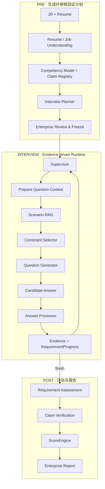

<div align="center">

# 衡鉴 · Evidence Hiring

**基于 LangGraph 的 Evidence-driven AI 面试评估系统**

从 JD 与候选人简历生成可审核的面试计划，根据实时回答动态追问，  
并让最终能力判断能够回溯到具体 Evidence 与原始回答。

[产品流程](#产品流程) · [核心能力](#核心能力) · [关键工程设计](#关键工程设计) · [系统架构](#系统架构) · [快速运行](#快速运行)

[](https://github.com/hr-huang/AI_Interview/actions/workflows/ci.yml)
[](https://www.python.org/)
[](https://fastapi.tiangolo.com/)
[](https://langchain-ai.github.io/langgraph/)
[](https://react.dev/)


</div>

当前聚焦 **AI Agent / AI 应用工程师（`ai_application_engineering / 2026-H2`）**。

核心不是让 LLM “生成一组面试题”，而是建立一条：

```text
岗位要求 → 面试计划 → 动态验证 → Evidence → 确定性评分 → 企业报告
```

企业先审核并冻结验证计划；候选人的每轮回答会更新 Evidence 与 RequirementProgress，系统再决定继续追问、切换验证目标或结束面试。

## 产品流程

<table>
  <tr>
    <td width="50%" valign="top">
      <br>
      <strong>01 · 创建评估</strong><br>
      输入目标岗位、JD 与候选人材料，建立本次 Assessment。
    </td>
    <td width="50%" valign="top">
      <br>
      <strong>02 · 审核计划</strong><br>
      Planner 生成 Target 与 Evidence Requirement，企业审核后冻结 InterviewPlan。
    </td>
  </tr>
  <tr>
    <td width="50%" valign="top">
      <br>
      <strong>03 · 动态面试</strong><br>
      候选人逐题作答；回答进入 Evidence 与 Runtime 后再决定下一轮。
    </td>
    <td width="50%" valign="top">
      <br>
      <strong>04 · 证据报告</strong><br>
      能力结论、评分理由、原始回答和复试建议可以相互追溯。
    </td>
  </tr>
</table>

## 核心能力

### 1. 岗位驱动的面试规划

不是从固定题库随机抽题。系统先解析 JD 与 Resume，建立 Competency Model、候选人 Claim 和 Evidence Requirement，再生成整场 `InterviewPlan`。

`InterviewPlan` 在企业审核后冻结，后续动态面试只能围绕已经确定的验证目标展开。

### 2. Evidence-driven 动态追问

每轮回答经过 `AnswerProcessor` 后会形成新的 Evidence、矛盾点和缺失证据：

```text
Candidate Answer
      ↓
AnswerProcessor
      ↓
Evidence + Missing Evidence
      ↓
RequirementProgress
      ↓
Supervisor
      ↓
Follow-up / Next Requirement / Finish
```

因此“上一轮回答了什么”会真实改变下一轮验证路径，而不是按预生成题单顺序执行。

### 3. 受约束的 Scenario RAG

RAG 不拥有面试决策权。

```text
Supervisor          决定这一轮验证什么
        ↓
Scenario RAG        为已锁定考点选择业务场景
        ↓
Constraint Selector 选择本轮允许使用的审核约束
        ↓
QuestionGenerator   把锁定内容表达成自然问题
```

这样可以把“考什么”和“放在哪个业务场景里考”分开，避免向量检索结果反过来控制面试目标。

### 4. 可追溯的确定性评分

数值分数不由 QuestionGenerator、RAG 或前端直接给出：

```text
Evidence
→ Requirement Assessment
→ Claim Verification
→ ScoreEngine
→ Assessment Report
```

`ScoreEngine` 是唯一数值评分入口；报告页只消费服务端结果，并提供 Evidence / Transcript 追溯。

## 关键工程设计

### Agent 决策边界

项目刻意没有把所有步骤都交给 LLM：

| 模块 | 职责 |
| --- | --- |
| `Planner` | 决定整场需要验证什么 |
| `Supervisor` | 决定下一轮验证目标、题型和是否结束 |
| `Scenario RAG` | 为已锁定目标选择业务上下文 |
| `Constraint Selector` | 控制本轮可以暴露的 reviewed constraint |
| `QuestionGenerator` | 负责自然语言表达 |
| `ScoreEngine` | 唯一数值评分入口 |

这种边界让 LLM 负责需要生成与理解的部分，把停止条件、评分和关键约束保留在可测试的程序逻辑中。

### 静态 Plan 与动态 Runtime 分离

```text
InterviewPlan
= 本场面试“要验证什么”
= 冻结后保持稳定

InterviewRuntimeState
= 当前已经问到哪里、拿到了什么 Evidence、还缺什么
= 随每轮回答持续变化
```

这样既允许动态追问，又避免候选人的某一句回答让整场评价标准漂移。

### RAG 与评分隔离

审核后的 Scenario JSON 是事实源，Qdrant 只是可重建的检索索引。Embedding / Reranker 影响问题上下文，但不能改变 Rubric 或直接产生分数。

检索校准方法与历史结果见 [工程验证与检索校准](docs/engineering/VALIDATION.md)。

### Assessment 级模型运行时

创建 Assessment 时可以使用服务器默认模型，也可以通过页面 BYOK 创建独立 Model Session。自定义 API Key 不写入 Assessment JSON；运行时通过 Assessment 绑定模型会话，避免不同评估共享可变的全局模型配置。

当前 Secret 只保存在服务进程内存，因此服务重启后对应 BYOK Session 会失效；这是当前版本明确保留的生产化边界。

## 系统架构



## Tech Stack

| 层 | 技术 |
| --- | --- |
| Agent / Workflow | LangGraph · Structured Output · Checkpoint |
| Backend | Python · FastAPI · Pydantic · SQLite |
| Retrieval | Qdrant · Embedding · optional Reranker |
| Frontend | React · TypeScript · Vite |
| Document Parsing | PyMuPDF · python-docx · RapidOCR |
| Engineering | pytest · Vitest · GitHub Actions · uv · pnpm |

## 快速运行

### 1. 安装依赖

```powershell
git clone https://github.com/hr-huang/AI_Interview.git
Set-Location AI_Interview
uv sync --frozen --dev
pnpm --dir web install --frozen-lockfile
```

### 2. 启动后端

```powershell
uv run uvicorn profile_agent.web.app:create_app --factory --host 127.0.0.1 --port 8000
```

### 3. 启动前端

```powershell
pnpm --dir web dev
```

然后可以直接打开冻结匿名 Demo：

```text
http://127.0.0.1:5173/demo/assessment
```

该页面无需模型 API Key。

如果要使用自己的 JD 与简历走完整链路，打开：

```text
http://127.0.0.1:5173/assessments/new
```

模型配置可以使用 `.env` 或页面级 BYOK，环境变量模板见 [`.env.example`](.env.example)。

## 当前范围

| 已实现 | 当前边界 |
| --- | --- |
| JD / Resume 解析与 InterviewPlan | 当前聚焦单一 `ai_application_engineering / 2026-H2` Role Pack |
| 企业审核 / Freeze / Candidate Link | 尚未实现企业账号与多租户授权 |
| Evidence Gap 驱动动态面试 | BYOK Secret 当前只保存在单进程内存 |
| Scenario Module RAG + reviewed fallback | 当前使用单机 SQLite / Checkpoint |
| Claim Verification + deterministic ScoreEngine | 尚未加入语音 / 虚拟数字人 |
| 企业报告、Radar、Transcript、Evidence Trace | 尚未发布公开生产环境 |

## Documentation

- [项目完整说明](docs/PROJECT_DETAILS.md) — 数据模型、产品边界和实现细节
- [代码执行链导览](docs/CODE_WALKTHROUGH.md) — 从请求到 Graph / Evidence / Report 的代码路径
- [工程验证与检索校准](docs/engineering/VALIDATION.md) — CI、测试、Scenario RAG 校准与固定回归案例
- [Roadmap](docs/ROADMAP.md) — Long-term Memory、Scenario Intelligence、Observability、Evidence Tools、Role Pack 等后续方向

---

> 衡鉴当前是一个面向 AI Agent / LLM 应用工程方向的完整工程作品：重点不在“用了多少 Agent 技术名词”，而在于把动态决策、RAG、Evidence、评分和 Web 产品链路放进同一套可运行、可测试的系统中。
