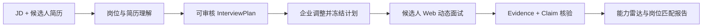
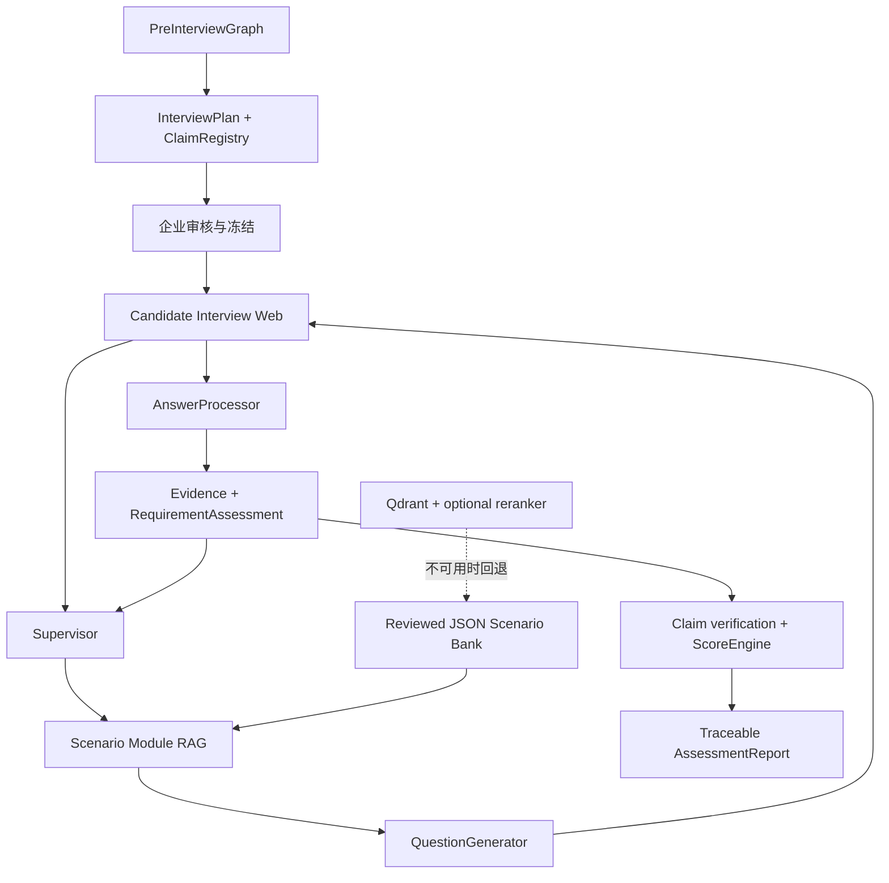

# 衡鉴 Evidence Hiring

面向企业招聘的 AI Agent 胜任力评估：`JD + resume → reviewable plan → adaptive interview → traceable competency report`

衡鉴把岗位描述与候选人简历转成可审核的面试计划，根据候选人的真实回答动态调整追问，并让能力结论、岗位匹配判断与原始 Evidence 相互可追溯。当前版本聚焦 `ai_application_engineering / 2026-H2`，不冒充尚未实现的多岗位平台。

[](https://www.python.org/) [](https://langchain-ai.github.io/langgraph/) [](https://react.dev/) [](https://fastapi.tiangolo.com/)

## 从企业材料到证据化报告



- **Planner 决定考什么**：把岗位能力和简历声明整理成 Target、Evidence Requirement、优先级与推荐题型。
- **企业先审核再开考**：计划调整受角色标准与最低验证要求约束，冻结后生成候选人面试链接。
- **Supervisor 决定下一步验证什么**：依据已有 Evidence、矛盾、缺口、剩余时间和题数预算动态推进。
- **Scenario Module RAG 提供业务场景**：从 10 个场景、35 个检索模块和 38 个隐藏约束中选择合适上下文；QuestionGenerator 只负责把已锁定的考点表达成自然问题。
- **ScoreEngine 只按证据评分**：未验证维度保留 `UNVERIFIED`，覆盖率或门槛不足时不强行发布岗位匹配分。

## 快速开始

前置条件：Git、Python 3.11+、Node.js `^20.19.0` 或 `>=22.12.0`、`uv`、`pnpm@11.19.0`。

```powershell
git clone https://github.com/hr-huang/AI_Interview.git
Set-Location AI_Interview
uv sync --frozen --dev
if (-not (Test-Path .env)) { Copy-Item .env.example .env }
```

终端 A：

```powershell
uv run uvicorn profile_agent.web.app:create_app --factory --host 127.0.0.1 --port 8000
```

终端 B：

```powershell
pnpm --dir web install
pnpm --dir web dev
```

启动后可访问：

| 入口 | 地址 | 用途 |
| --- | --- | --- |
| 真实评估 | <http://127.0.0.1:5173/assessments/new> | 输入 JD、简历，可选配置自己的推理模型，生成并审核面试计划。 |
| 候选人面试 | `/interviews/{candidateToken}` | 冻结计划后生成；候选人逐题回答，后端根据 Evidence 动态追问。 |
| 演示示例 | <http://127.0.0.1:5173/demo/assessment> | 不调用模型，直接查看冻结的完整评估报告。 |
| 演示 API | <http://127.0.0.1:8000/api/demo/assessment> | 查看演示报告的后端 JSON。 |

真实评估有两种模型配置方式：服务器 `.env` 默认配置，或创建评估页里的“模型设置”。自定义模型会先进行真实 Structured Output 兼容性测试，通过后才生成临时模型会话。API Key 只保存在当前服务进程内存，不写入评估数据库；服务重启后自定义模型会话会显式失效，不会静默切换到服务器默认模型。Embedding、Reranker 与 Qdrant 仍由系统固定管理，避免查询向量与索引向量不兼容。

## 动态面试如何工作



1. `Planner` 生成整场静态验证计划。
2. `Supervisor` 每轮只决定当前 Requirement、题型和是否结束。
3. `ScenarioRetriever` 用维度、题型、难度与 Evidence gap 检索 `场景 × 能力` 模块；Qdrant 只是可重建索引，JSON Bank 才是事实源。
4. `QuestionGenerator` 不自由选择考点，只把已锁定上下文写成候选人可理解的问题。
5. 候选人页面每次只提交当前 `turn_id + answer + idempotency_key`，不暴露 Requirement、Constraint、Score 等内部状态。
6. `AnswerProcessor` 提取支持、限制、矛盾和缺失 Evidence；Python 再确定性更新 Runtime。
7. 报告阶段由 `ScoreEngine` 唯一生成数值，前端雷达图不重新计算分数。

## 模型配置边界

创建评估页当前开放的是**推理/生成模型**：Qwen、DeepSeek、GLM 与高级 OpenAI-compatible 入口。不同评估的 Key/Base URL/Model 通过独立的运行时上下文隔离，不通过修改全局环境变量切换，因此并发请求不会共享当前模型配置。

场景检索的 Embedding/Reranker/Qdrant 不开放给普通用户切换。原因是现有 Scenario Module 索引由固定 embedding contract 构建；任意切换 embedding 模型会让查询向量与库内向量失去可比性。

公开自定义 Base URL 仅接受 HTTPS，并拒绝 localhost 与直接私有/链路本地 IP。当前实现仍属于本机/单实例 BYOK 方案；生产级多实例部署需要外部 Secret Store/会话存储，而不是把 API Key 明文持久化到数据库。

## 校准与可复现性

冻结的 Scenario Module RAG 校准集包含 24 个 reviewed cases：

| 指标 | 结果 | 说明 |
| --- | --- | --- |
| Top-1 acceptable | `24/24` | 运行时采用的 Top-1 全部位于可接受模块集合。 |
| Top-3 recall | `24/24` | 可接受模块全部进入 Top-3。 |
| forbidden Top-1 | `0` | 没有错误业务世界成为最终选择。 |
| fallback | `0` | 本次冻结校准没有回退。 |
| Top-3 forbidden diagnostics | `7` | 相邻业务世界仍有七个诊断命中；它们不参与 acceptance gate，但需要持续治理。 |

设计冻结时的后端快照为 `868 passed, 6 warnings, 827 subtests passed`；前端为 `38 passed`，并通过 TypeScript + Vite 生产构建。数字是可复核的历史快照，不作为永久徽章。当前 CI 会同时执行后端 pytest、前端 Vitest 和 TypeScript/Vite 生产构建。

```powershell
uv run pytest -q
pnpm --dir web test
pnpm --dir web build
```

Scenario Bank 的离线校验和预览不会调用 provider：

```powershell
uv run python run_scenario_bank.py validate
uv run python run_scenario_bank.py rebuild-index
uv run python run_scenario_bank.py evaluate
```

只有显式使用 `--apply` 才会执行真实 embedding、Qdrant 写入或检索校准，并可能产生费用。

## 当前交付边界

| 已实现 | 尚未声称完成 |
| --- | --- |
| JD/简历输入与文档解析 | 多岗位 Role Pack |
| 可审核、可冻结的 InterviewPlan | 生产级云端多实例部署 |
| 候选人 Web 动态问答页与幂等提交 | 持久化 BYOK Secret Store |
| 后端动态面试 Runtime 与 API | 语音/虚拟人面试 |
| Scenario Module RAG 与 reviewed fallback | 已发布 Docker 镜像 |
| Evidence、Claim 核验与确定性评分 | 对外承诺的通用招聘决策系统 |
| 企业报告、雷达图与证据追溯 | LICENSE（当前仓库尚未选择许可证） |

报告用于辅助企业招聘判断，不自动输出录用或淘汰结论。

## 文档导航

- [完整项目说明](docs/PROJECT_DETAILS.md)
- [环境变量模板](.env.example)
- [README 设计说明](docs/superpowers/specs/2026-08-31-competition-first-readme-design.md)
- [README 实施说明](docs/superpowers/plans/2026-08-31-competition-first-readme.md)
- [代码结构导览](docs/CODE_WALKTHROUGH.md)

## 许可证与容器镜像

当前仓库尚未提供 `LICENSE`，也没有发布到 Docker Hub 的镜像，因此暂不展示 License 或 Docker Pulls 徽章。后续只有在许可证文件和公开镜像真实存在后才会补充相应徽章与使用说明。
