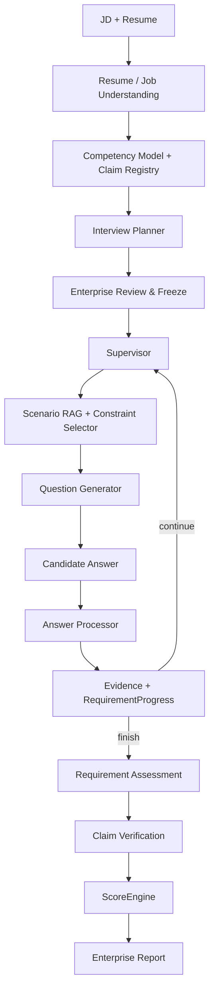

<div align="center">

# 衡鉴 · Evidence Hiring

**基于 LangGraph 的 Evidence-driven AI 面试评估系统**

从 JD 与候选人简历生成可审核的面试计划，根据实时回答动态追问，  
并让最终能力判断能够回溯到具体 Evidence 与原始回答。

[产品流程](#产品流程) · [核心能力](#核心能力) · [关键工程设计](#关键工程设计) · [系统架构](#系统架构) · [快速运行](#快速运行)

[](https://github.com/hr-huang/AI_Interview/actions/workflows/ci.yml)
[](https://www.python.org/)
[](https://fastapi.tiangolo.com/)
[](https://langchain-ai.github.io/langgraph/)
[](https://react.dev/)

<a href="docs/assets/readme/hero-report.png">
  
</a>

</div>

当前聚焦 **AI Agent / AI 应用工程师（`ai_application_engineering / 2026-H2`）**。

> 核心不是让 LLM “生成一组面试题”，而是建立一条从 **岗位要求 → 动态验证 → Evidence → 确定性评分** 的完整验证链路。

## 产品流程

**01 创建评估** → **02 审核并冻结 InterviewPlan** → **03 候选人动态面试** → **04 企业查看证据报告**

企业先决定要验证什么；候选人的每轮回答再更新 Evidence 与 RequirementProgress，系统据此继续追问、切换验证目标或结束面试。

### 计划审核

<a href="docs/assets/readme/workflow-plan.png">
  
</a>

Planner 从 JD、Resume、Competency Model 与 Claim 中生成 Target / Evidence Requirement，企业审核后冻结整场 `InterviewPlan`。

### 动态面试

<a href="docs/assets/readme/workflow-interview.png">
  
</a>

候选人一次只看到当前问题；回答进入 Runtime 后，下一轮由当前 Evidence Gap 决定，而不是从预生成题单继续往下走。

<details>
<summary><strong>查看完整四步产品截图</strong></summary>

#### 01 · 创建评估

<a href="docs/assets/readme/workflow-create.png"></a>

#### 02 · 审核计划

<a href="docs/assets/readme/workflow-plan.png"></a>

#### 03 · 动态面试

<a href="docs/assets/readme/workflow-interview.png"></a>

#### 04 · 证据报告

<a href="docs/assets/readme/workflow-report-evidence.png"></a>

</details>

## 核心能力

| 能力 | 实现方式 |
| --- | --- |
| **岗位驱动规划** | `JD + Resume → Competency Model / Claim → InterviewPlan`，不是固定题库抽题 |
| **Evidence-driven 动态追问** | AnswerProcessor 生成 Evidence 与 Missing Evidence，Supervisor 据此决定 Follow-up / Next / Finish |
| **受约束 Scenario RAG** | Supervisor 先锁定 Requirement，RAG 只选择业务场景，Constraint Selector 再控制本轮约束 |
| **可追溯确定性评分** | `Evidence → Requirement Assessment → Claim Verification → ScoreEngine`，报告可回到原始回答 |

## 关键工程设计

### 1. Agent 决策边界

项目没有把所有步骤都交给 LLM：

| 模块 | 决策职责 |
| --- | --- |
| `Planner` | 整场需要验证什么 |
| `Supervisor` | 下一轮验证目标、题型以及是否结束 |
| `Scenario RAG` | 为已锁定目标选择业务上下文 |
| `Constraint Selector` | 控制本轮允许释放的 reviewed constraint |
| `QuestionGenerator` | 将锁定内容表达成自然语言问题 |
| `ScoreEngine` | 唯一数值评分入口 |

LLM 负责需要理解和生成的部分；停止条件、评分和关键约束保留在可测试的程序逻辑中。

### 2. 静态 Plan 与动态 Runtime 分离

| `InterviewPlan` | `InterviewRuntimeState` |
| --- | --- |
| 定义本场面试“要验证什么” | 记录当前“验证到哪里、拿到了什么、还缺什么” |
| 企业审核后冻结 | 随每轮回答持续变化 |
| 防止评价标准漂移 | 支持动态追问和状态恢复 |

### 3. RAG 不拥有评分权

审核后的 Scenario JSON 是事实源，Qdrant 是可重建的检索索引。Embedding / Reranker 只影响问题上下文，不能修改 Rubric，也不能直接产生分数。

`ScoreEngine` 只消费结构化 Evidence / Assessment 结果。检索校准与固定回归案例见 [工程验证与检索校准](docs/engineering/VALIDATION.md)。

### 4. Assessment 级模型运行时

每个 Assessment 可以使用服务器默认模型，也可以通过页面 BYOK 创建独立 Model Session。自定义 API Key 不写入 Assessment JSON，运行时按 Assessment 绑定模型会话，避免不同评估共享可变的全局模型配置。

当前 Secret 仍只保存在服务进程内存，因此服务重启后对应 BYOK Session 会失效；这是当前版本明确保留的生产化边界。

## 系统架构



这条主链对应三段职责：**PRE 生成并冻结验证计划 → INTERVIEW 根据 Evidence 动态运行 → POST 完成评估与报告**。

## Tech Stack

| 层 | 技术 |
| --- | --- |
| Agent / Workflow | LangGraph · Structured Output · Checkpoint |
| Backend | Python · FastAPI · Pydantic · SQLite |
| Retrieval | Qdrant · Embedding · optional Reranker |
| Frontend | React · TypeScript · Vite |
| Document Parsing | PyMuPDF · python-docx · RapidOCR |
| Engineering | pytest · Vitest · GitHub Actions · uv · pnpm |

## 快速运行

```powershell
git clone https://github.com/hr-huang/AI_Interview.git
Set-Location AI_Interview
uv sync --frozen --dev
pnpm --dir web install --frozen-lockfile
```

启动后端：

```powershell
uv run uvicorn profile_agent.web.app:create_app --factory --host 127.0.0.1 --port 8000
```

启动前端：

```powershell
pnpm --dir web dev
```

无需模型 API Key 的冻结 Demo：`http://127.0.0.1:5173/demo/assessment`

使用自己的 JD / 简历：`http://127.0.0.1:5173/assessments/new`

模型配置支持 `.env` 或页面级 BYOK，模板见 [`.env.example`](.env.example)。

## 当前范围

**已实现**：JD / Resume 解析、InterviewPlan 审核与冻结、Candidate Link、Evidence Gap 动态面试、Scenario Module RAG、Claim Verification、确定性 ScoreEngine、企业报告 / Radar / Transcript / Evidence Trace。

**当前边界**：单一 `ai_application_engineering / 2026-H2` Role Pack、单机 SQLite / Checkpoint、BYOK Secret 仅内存保存；尚未完成企业多租户认证、语音 / 虚拟数字人和公开生产部署。

## Documentation

- [项目完整说明](docs/PROJECT_DETAILS.md) — 数据模型、产品边界和实现细节
- [代码执行链导览](docs/CODE_WALKTHROUGH.md) — 从请求到 Graph / Evidence / Report 的代码路径
- [工程验证与检索校准](docs/engineering/VALIDATION.md) — CI、测试、Scenario RAG 校准与固定回归案例
- [Roadmap](docs/ROADMAP.md) — Long-term Memory、Scenario Intelligence、Observability、Evidence Tools、Role Pack 等后续方向
