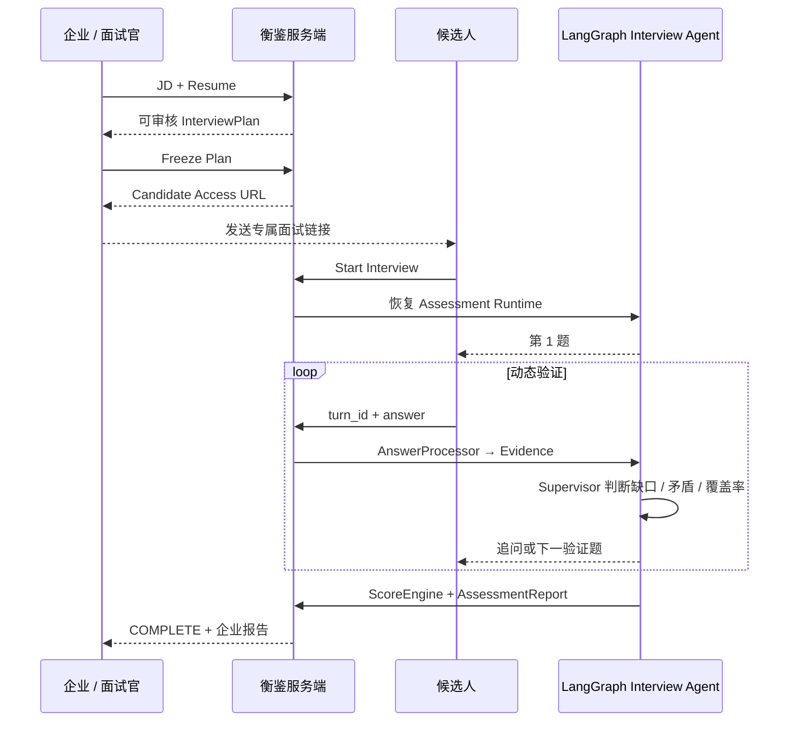
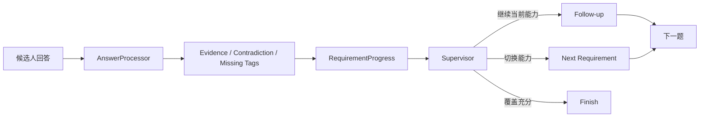
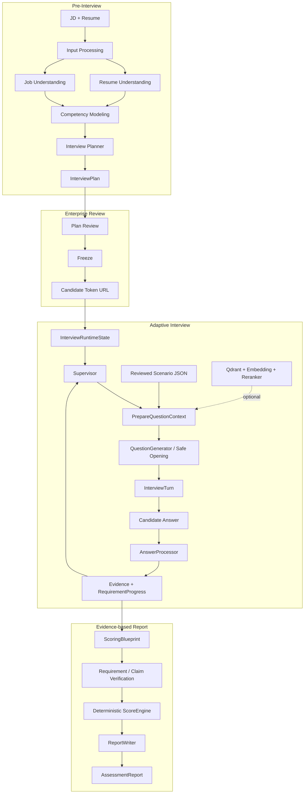

# 衡鉴 · Evidence Hiring

> **把 JD 与简历变成可审核的验证计划，让候选人接受动态 AI 面试，再把每个能力结论追溯到真实回答证据。**

[](https://github.com/hr-huang/AI_Interview/actions/workflows/ci.yml)
[](https://www.python.org/)
[](https://fastapi.tiangolo.com/)
[](https://langchain-ai.github.io/langgraph/)
[](https://react.dev/)

**衡鉴（Evidence Hiring）** 是一个面向企业招聘场景的 AI Agent 胜任力评估系统。当前版本聚焦 **AI Agent / AI 应用工程师（`ai_application_engineering / 2026-H2`）**，完成了从企业创建评估、计划审核、候选人动态面试，到 Evidence 驱动评分与企业报告的完整闭环。

它不是“让 LLM 随机出几道题”，也不是把固定题库套上一层聊天 UI。系统把 **考什么、怎么追问、场景怎么选、证据怎么形成、谁可以打分** 分成独立边界，并把关键决策留在可测试的确定性代码里。

---

## 30 秒看懂这个项目

| 角色 | 实际操作 | 系统结果 |
| --- | --- | --- |
| **企业 / 面试官** | 输入 JD + 候选人简历 → 审核 InterviewPlan → 冻结 → 发送专属链接 | 实时看到 `等待开始 → 面试中 → 生成报告 → 已完成`，最终进入企业评估报告 |
| **候选人** | 打开专属 `/interviews/{token}` → 一次只回答一道题 | 后续问题会根据上一轮 Evidence 动态变化；候选人看不到 Rubric、分数和内部约束 |
| **AI 面试系统** | Supervisor 决定当前验证目标，Scenario RAG 提供业务场景，AnswerProcessor 提取证据 | Evidence / Claim / Requirement 状态持续更新，ScoreEngine 最后统一评分 |



---

## 真实运行页面

下面不是设计稿，而是本地完整链路实际运行后，候选人完成整场面试时的页面：


候选人端只承担三件事：**显示当前问题、提交当前回答、显示完成状态**。计划、Evidence Requirement、Constraint、评分权重和最终企业结论都不会暴露给候选人。

企业端在计划冻结后会持续读取同一个 Assessment 的状态；候选人开始、作答、完成后，企业侧会依次看到：

```text
等待候选人开始
        ↓
候选人面试中
        ↓
正在生成评估报告
        ↓
面试已完成
        ↓
[查看评估报告]
```

因此候选人的回答不需要“再传回企业电脑”：企业浏览器和候选人浏览器始终访问同一个 FastAPI + Assessment 数据源，候选人的每一次提交都会立即进入对应 Assessment 的 LangGraph Runtime。

---

## 为什么它不只是“LLM 面试机器人”

### 1. 企业先审核，再允许 AI 面试

```text
JD + Resume
   ↓
Resume / Job Understanding
   ↓
Competency Modeling
   ↓
InterviewPlan
   ↓
企业审核 / 调整
   ↓
Freeze
   ↓
候选人才能开始
```

Planner 可以提出 Target、Evidence Requirement、优先级和推荐题型，但不会绕过企业直接开始评估。

### 2. 动态追问由 Evidence 缺口驱动

候选人回答后，不是简单地进入预先写好的“第 N 题”：



例如候选人已经证明“长期记忆可以存储和检索”，但没有说明更新、删除或版本处理，系统可以继续围绕这个 Evidence gap 追问，而不是重新问一个无关知识点。

### 3. RAG 不决定考什么，只决定“放在哪个业务场景里考”

当前 Scenario Bank 冻结为：

| 资产 | 数量 | 用途 |
| --- | ---: | --- |
| Reviewed enterprise scenarios | **10** | 企业级 Agent 业务世界 |
| Scenario × primary-capability modules | **35** | RAG 的原子检索单元 |
| Reviewed constraints | **38** | Follow-up 可暴露的审核约束 |
| Role dimensions | **6** | 最终能力雷达维度 |

核心边界：

> **Supervisor 决定考什么；RAG 决定放在哪个业务场景里考；Constraint Selector 决定本轮允许暴露哪个审核过的约束；QuestionGenerator 只负责把锁定内容问自然。**

如果向量检索不可用，系统可以回退到 reviewed JSON；如果当前 Requirement 根本不存在兼容的 reviewed ScenarioModule，则直接无场景出题，而不是硬塞一个错误业务场景导致候选人会话崩溃。

### 4. LLM 不能直接决定最终分数

```text
Interview Turns
      ↓
Evidence
      ↓
Requirement Evidence Assessment
      ↓
Claim Verification
      ↓
ScoringBlueprint
      ↓
ScoreEngine  ← 唯一数值权威
      ↓
AssessmentReport
```

未获得足够证据的维度可以保持 `UNVERIFIED`。报告不会把“没有验证到”偷换成“能力差”，前端雷达图也不会二次计算分数。

---

## 一次评估的系统执行链



### 静态与动态状态严格分离

- `InterviewPlan`：整场面试的静态验证计划，Freeze 后不随候选人回答任意漂移。
- `InterviewRuntimeState`：当前已问什么、还缺什么 Evidence、活跃场景、剩余预算等运行时状态。
- `Evidence`：报告和评分的事实源。
- `Qdrant`：可重建的派生索引，不是事实源，也不参与评分。

---

## 可复核数据

### Scenario RAG 冻结校准

校准集包含 **24 个 reviewed cases**：

| 指标 | 冻结结果 | Acceptance 含义 |
| --- | ---: | --- |
| Top-1 acceptable | **24 / 24** | 最终 Top-1 全部属于可接受模块 |
| Top-3 recall | **24 / 24** | 可接受模块全部进入 Top-3 |
| Forbidden Top-1 | **0** | 没有错误业务世界成为最终选择 |
| Fallback | **0** | 冻结校准没有触发 fallback |
| Top-3 forbidden diagnostics | **7** | 邻近业务世界仍有诊断命中，但不进入最终 Top-1 acceptance |

### 当前自动化验证快照（2026-09-01）

| 验证层 | 结果 |
| --- | ---: |
| Backend pytest | **883 passed** |
| Backend subtests | **831 passed** |
| Frontend Vitest | **43 / 43 passed** |
| Frontend test files | **12 / 12 passed** |
| TypeScript + Vite production build | **PASS** |

CI 同时覆盖后端测试、前端交互测试和生产构建。尤其包含真实生产形状的候选人 `/start` 回归：`ScenarioCatalog + LazyScenarioRetriever + reviewed fallback + LangGraph checkpoint + HTTP API`，防止“单元测试全绿、真实候选人一点击开始却 500”的问题重新出现。

---

## 企业端与候选人端

### 企业侧

企业创建 Assessment 后可以：

1. 输入目标岗位、JD、候选人简历；
2. 查看 Planner 生成的候选人画像、Claim、能力维度与 Target；
3. 调整允许开放给业务方的有限参数并 Freeze；
4. 获得候选人专属一次性访问 URL；
5. 查看候选人 `READY → IN_PROGRESS → REPORTING → COMPLETE` 状态；
6. 完成后进入能力雷达、Evidence 引用、Claim 核验与岗位匹配报告。

### 候选人侧

候选人只通过专属 token 访问：

```text
/interviews/{candidateToken}
```

每轮只提交：

```text
turn_id + answer + idempotency_key
```

不会收到内部 Requirement、Constraint、Rubric、Evidence score 或企业报告。

> 本地开发生成的是 `http://localhost:5173/interviews/...`，只能本机模拟。真正交付企业使用时，React/FastAPI/数据库部署到公网域名后，企业把 `https://your-domain/interviews/...` 发给候选人即可。

---

## 模型与 RAG 配置边界

创建评估页支持推理模型配置：**Qwen、DeepSeek、GLM、OpenAI-compatible**。自定义配置会先做真实 Structured Output 探测，成功后才创建临时 Model Session。

- API Key 仅保存在当前服务进程内存，不写入 Assessment 数据库；
- 服务重启后自定义会话显式失效，不静默切换模型；
- 不同 Assessment 通过运行时上下文隔离模型配置；
- 普通用户不能切换 Scenario RAG 的 Embedding/Reranker/Qdrant contract；
- 自定义 Base URL 只接受 HTTPS，并拒绝直接 localhost / 私有 / 链路本地 IP；
- 当前 BYOK 是单实例实现，生产多实例需要外部 Secret Store / Session Store。

Scenario RAG 的 canonical source 是版本化 JSON Bank，Qdrant 只是可重建索引：

```text
Reviewed JSON
    ↓ rebuild
Embedding → Qdrant
              ↓
Runtime Query → Top-K → optional Reranker
              ↓
重新回读 JSON 做身份 / hard-filter 校验
              ↓
LockedScenarioContext
```

---

## 快速运行

前置：Git、Python 3.11+、Node.js `^20.19.0` 或 `>=22.12.0`、`uv`、`pnpm@11.19.0`。

```powershell
git clone https://github.com/hr-huang/AI_Interview.git
Set-Location AI_Interview
uv sync --frozen --dev
if (-not (Test-Path .env)) { Copy-Item .env.example .env }
pnpm --dir web install
```

终端 A：

```powershell
uv run uvicorn profile_agent.web.app:create_app --factory --host 127.0.0.1 --port 8000
```

终端 B：

```powershell
pnpm --dir web dev
```

浏览器打开：

```text
http://127.0.0.1:5173/assessments/new
```

推荐完整演示路径：

```text
模型连接测试
  ↓
输入 JD + 简历
  ↓
生成 InterviewPlan
  ↓
企业审核并 Freeze
  ↓
打开 Candidate URL
  ↓
连续回答并观察动态追问
  ↓
候选人完成
  ↓
回到企业 Plan 页查看 COMPLETE
  ↓
查看 Assessment Report
```

如果只想快速看完整企业报告而不调用模型：

```text
http://127.0.0.1:5173/demo/assessment
```

---

## Scenario Bank 运维

纯离线校验与预览不会调用 Provider：

```powershell
uv run python run_scenario_bank.py validate
uv run python run_scenario_bank.py rebuild-index
uv run python run_scenario_bank.py evaluate
```

只有显式 `--apply` 才会执行真实 Embedding、Qdrant 写入或 Retrieval Calibration，并可能产生 API 费用：

```powershell
uv run python run_scenario_bank.py rebuild-index --apply
uv run python run_scenario_bank.py evaluate --apply
```

---

## 当前交付边界

| 已实现并可运行 | 当前没有冒充完成 |
| --- | --- |
| JD / 简历输入与文档解析 | 多岗位 Role Pack |
| 可审核、可冻结 InterviewPlan | 生产级多租户企业权限系统 |
| Candidate Token Web Interview | 生产级云端多实例部署 |
| Evidence 驱动动态追问 | 持久化 BYOK Secret Store |
| Enterprise Status Monitor | 语音 / 虚拟人面试 |
| Scenario Module RAG + reviewed fallback | 已发布 Docker Hub 镜像 |
| Claim Verification + deterministic ScoreEngine | 全自动录用 / 淘汰决策 |
| 企业雷达图、报告与 Evidence Trace | LICENSE（当前仓库尚未选择许可证） |

**系统定位是招聘辅助决策工具，不自动输出录用/淘汰决定。**

---

## 代码与文档导航

| 路径 | 内容 |
| --- | --- |
| `profile_agent/graphs/` | Pre-Interview / Interview LangGraph |
| `profile_agent/services/` | Planner、RAG、Evidence、Scoring、Report 等核心服务 |
| `profile_agent/web/` | FastAPI、Assessment 生命周期、模型运行时、Persistence |
| `web/src/features/` | 企业创建/审核/报告与候选人面试页面 |
| `profile_agent/knowledge/scenario_banks/` | Scenario Bank canonical JSON |
| [`docs/PROJECT_DETAILS.md`](docs/PROJECT_DETAILS.md) | 完整项目说明 |
| [`docs/CODE_WALKTHROUGH.md`](docs/CODE_WALKTHROUGH.md) | 代码结构与执行链导览 |
| [`.env.example`](.env.example) | 本地环境变量模板 |

---

## License

当前仓库尚未提供 `LICENSE`，也没有发布 Docker Hub 镜像，因此暂不展示虚假的 License / Docker Pulls 徽章。只有在真实发布后才补充对应声明。
