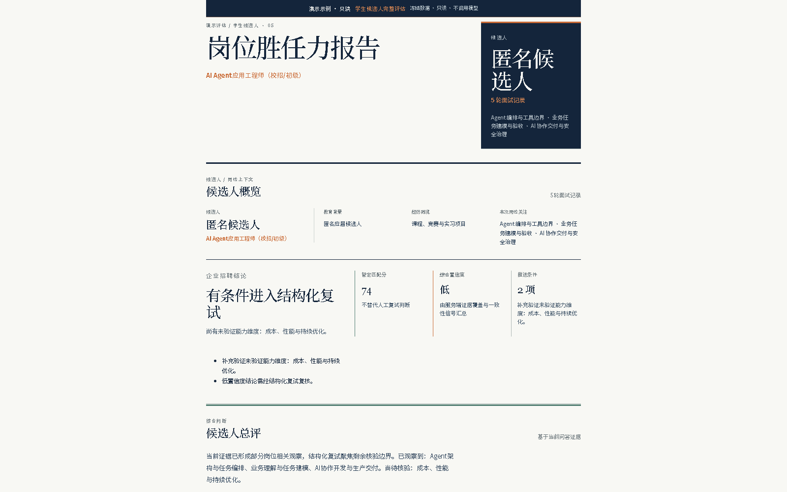
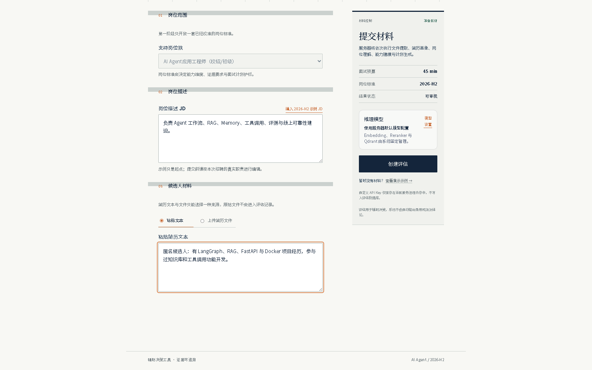
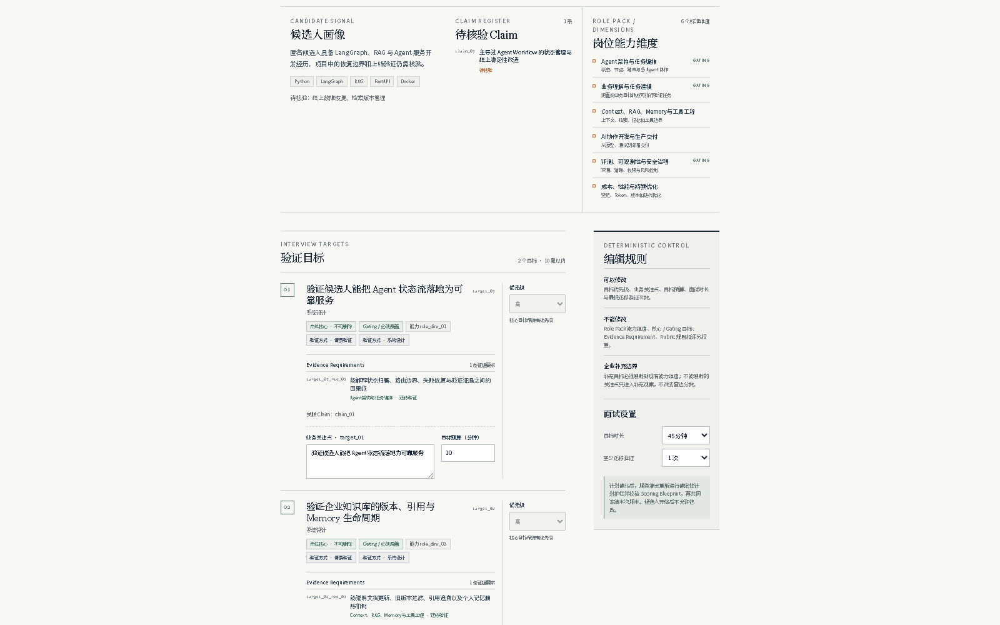
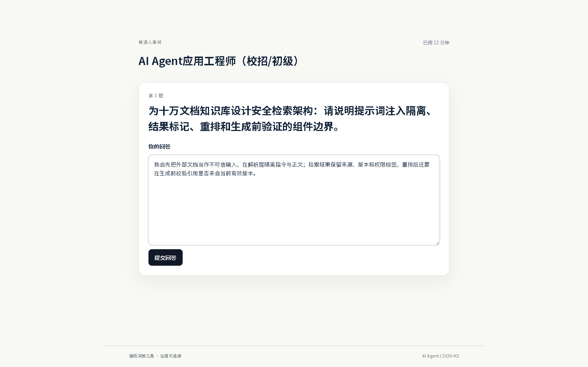
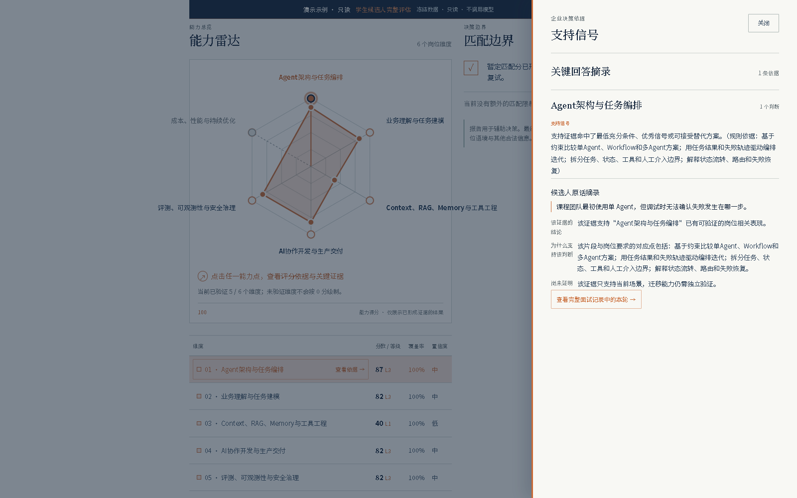
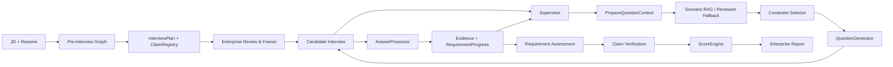

<div align="center">

# 衡鉴 · Evidence Hiring

**Evidence-driven AI Interview Agent**

从 JD 与候选人简历生成可审核的动态面试，<br>
让每项能力结论都能追溯到候选人的原始回答。

[产品链路](#一次评估如何完成) · [系统架构](#系统架构) · [本地运行](#本地运行)

[](https://github.com/hr-huang/AI_Interview/actions/workflows/ci.yml)
[](https://www.python.org/)
[](https://fastapi.tiangolo.com/)
[](https://langchain-ai.github.io/langgraph/)
[](https://react.dev/)



</div>

衡鉴面向企业招聘场景，当前聚焦 **AI Agent / AI 应用工程师（`ai_application_engineering / 2026-H2`）**。企业输入 JD 与候选人材料，审核并冻结面试计划；候选人逐题作答后，系统根据已形成的 Evidence 决定继续追问、切换验证目标或结束，最终生成可追溯的岗位胜任力报告。

## 一次评估如何完成

以下画面来自当前 React 产品页面，使用冻结匿名 Demo 或匿名确定性页面数据，不包含私人 JD、候选人身份和模型密钥。

<table>
  <tr>
    <td width="50%" valign="top">
      <br>
      <strong>01 · 创建评估</strong><br>
      企业输入目标岗位、JD 与候选人材料，建立本次评估上下文。
    </td>
    <td width="50%" valign="top">
      <br>
      <strong>02 · 审核计划</strong><br>
      Planner 生成 Target 与 Evidence Requirement；企业可以调整业务重点，但不能删除岗位基线。
    </td>
  </tr>
  <tr>
    <td width="50%" valign="top">
      <br>
      <strong>03 · 动态面试</strong><br>
      候选人一次只看到当前问题；每轮回答进入 Evidence 与 Runtime，再决定下一步。
    </td>
    <td width="50%" valign="top">
      <br>
      <strong>04 · 证据报告</strong><br>
      能力维度、判断理由、原始回答片段和复试建议可以相互追溯。
    </td>
  </tr>
</table>

完整链路：

```text
JD / Resume
→ InterviewPlan
→ Plan Review & Freeze
→ Dynamic Interview
→ Evidence / RequirementAssessment
→ Deterministic Scoring
→ Enterprise Report
```

## 我解决的不是“出题”，而是验证链路

| 工程问题 | 当前设计 | 可复核证据 |
| --- | --- | --- |
| 固定题库不能根据回答改变方向 | `Evidence Gap → RequirementProgress → Supervisor` | Graph 集成测试验证 gap 会改变下一轮 Constraint |
| RAG 容易越权决定考点 | Planner 固定整场计划，Supervisor 锁定下一轮 Requirement；默认 Scenario RAG 路径只选择业务场景 | 检索请求按维度、题型、Requirement 类型和难度过滤；无合适模块时安全回退 |
| LLM 直接给分难以解释 | `Evidence → RequirementAssessment → Claim Verification → ScoreEngine` | 未验证维度保持 `UNVERIFIED`；前端不重新计算分数 |
| 不同评估的自定义模型可能串线 | Assessment 级 Runtime 与内存态 BYOK Session 隔离 | Model Session API 先做 Structured Output 探测，密钥不写入 Assessment JSON |
| 检索效果不能只靠“感觉相关” | 固定校准问题、acceptable/forbidden 集合与重复运行 | 24 条 reviewed cases，发布前检查 Top-1、Top-3、Forbidden 与 Fallback |

职责边界：

```text
Planner             决定整场计划考什么
Supervisor          决定下一轮验证什么、采用什么题型、是否结束
Scenario RAG        为已锁定的考点选择业务场景
Constraint Selector 选择本轮允许释放的审核约束
QuestionGenerator   只把锁定内容表达成自然问题
ScoreEngine         是唯一数值评分入口
```

## 为什么上一轮回答会改变下一题

仓库中的 Graph 集成测试验证了下面这条真实状态链：

```text
当前 Requirement
Memory 写入 / 删除边界 · role_dim_03

候选人回答后的结构化判断
“Memory 删除已说明，但未证明版本与引用。”

AnswerProcessor
missing_evidence_tags = ["版本", "引用"]

InterviewRuntimeState
latest_gap_tags = ["版本", "引用"]

下一轮 Constraint Selector
selected = knowledge_policy_version_stale
not selected = knowledge_memory_delete
```

这证明上一轮结果改变了 Runtime 中的 Evidence Gap，Gap 又改变了下一轮可选择的约束。测试使用受控的 `StructuredAnswerLLM` 输出，以 patch 固定首题与 `follow_up` 动作，并用 `GeneratorSpy` 验证 Graph 接线。因此它证明的是 `AnswerProcessor → Runtime → Constraint Selector` 的状态传递与选择逻辑，不声称这条测试同时证明了 Supervisor 的自主决策，也不编造一条不存在的自然语言追问。测试见 [`tests/test_scenario_rag_graph_integration.py`](tests/test_scenario_rag_graph_integration.py)。

## 系统架构



- `InterviewPlan` 是整场静态验证计划，冻结后不随候选人回答任意漂移。
- `InterviewRuntimeState` 保存当前进度、Evidence Gap、活跃场景和已释放约束。
- JSON Scenario Bank 是事实源；Qdrant 是可以重建的检索索引，不参与评分。
- 报告页只展示服务端评分结果，并允许从能力维度回到 Evidence 和原始回答。

## 可复核结果

### Scenario RAG 历史校准快照

下表是当前 `2026-H2` Scenario Bank 设计冻结时记录的 reviewed calibration 快照；仓库可直接核验 24 条固定案例、校准规则和对应测试，但没有把本地 Provider 运行产物作为版本化发布报告提交。

| 指标 | 当前冻结结果 | 含义 |
| --- | ---: | --- |
| Reviewed cases | 24 | 固定的检索校准问题 |
| Top-1 acceptable | 24 / 24 | 最终采用的模块都在可接受集合中 |
| Top-3 recall | 24 / 24 | 可接受模块进入 Top-3 |
| Forbidden Top-1 | 0 | 错误业务场景没有成为最终选择 |
| Fallback | 0 | 本次校准未触发回退 |
| Top-3 forbidden diagnostics | 7 | 只用于发现相邻场景干扰，不是发布失败项 |

### 自动化验证

以下结果于 **2026-09-02** 在本分支本地验收；前端采用单 worker，避免 Windows 并发资源争用造成测试超时。

```text
Backend   883 passed · 6 warnings · 831 subtests passed
Frontend  12 test files · 43 tests passed · single worker
Build     TypeScript + Vite production build passed
```

最终数字以当前分支重新执行下列命令为准：

```powershell
uv run pytest -q
pnpm --dir web test -- --maxWorkers=1 --minWorkers=1
pnpm --dir web build
uv run python run_scenario_bank.py validate
```

## 本地运行

前置条件：Git、Python 3.11+、Node.js `^20.19.0` 或 `>=22.12.0`、[`uv`](https://docs.astral.sh/uv/) 和 `pnpm@11.19.0`。

### 路径 A：先看冻结演示，不调用模型

```powershell
git clone https://github.com/hr-huang/AI_Interview.git
Set-Location AI_Interview
uv sync --frozen --dev
pnpm --dir web install --frozen-lockfile
```

终端 A：

```powershell
uv run uvicorn profile_agent.web.app:create_app --factory --host 127.0.0.1 --port 8000
```

终端 B：

```powershell
pnpm --dir web dev
```

打开 <http://127.0.0.1:5173/demo/assessment>。该页面使用冻结匿名数据，不调用付费 LLM Provider。

### 路径 B：使用自己的 JD 与简历

1. 从 [`.env.example`](.env.example) 复制 `.env`，配置服务器默认模型；也可以在创建评估页使用 Assessment 级 BYOK。
2. 打开 <http://127.0.0.1:5173/assessments/new>，输入 JD 并上传或粘贴候选人材料。
3. 等待分析完成，审核并冻结 InterviewPlan，再把生成的候选人链接用于面试。

页面级 BYOK 会先验证 Structured Output 兼容性；API Key 只保存在当前服务进程内存，不写入 Assessment 数据。服务重启后该模型会话会失效，不会静默切换到其他模型。

## 技术选型

| 用途 | 选型 | 在项目中的职责 |
| --- | --- | --- |
| Agent 编排 | LangGraph | Pre-Interview、动态面试、Checkpoint 与中断恢复 |
| API 与数据契约 | FastAPI + Pydantic | 企业、候选人和模型会话 API |
| 企业与候选人页面 | React + TypeScript + Vite | 计划审核、逐题面试、报告与证据交互 |
| 状态与持久化 | SQLite + LangGraph Checkpoint | Assessment 生命周期和面试 Runtime |
| 场景检索 | Qdrant + Embedding + optional Reranker | 从审核过的场景模块中检索业务上下文 |
| 文档解析 | PyMuPDF + python-docx + RapidOCR | PDF、DOCX、TXT 与扫描 PDF 页 OCR |

<details>
<summary>Scenario Bank 校验与索引命令</summary>

纯校验与预览不会调用 Provider：

```powershell
uv run python run_scenario_bank.py validate
uv run python run_scenario_bank.py rebuild-index
uv run python run_scenario_bank.py evaluate
```

只有显式加入 `--apply` 才会执行真实 Embedding、Qdrant 写入或检索校准，并可能产生费用。

</details>

<details>
<summary>主要代码目录</summary>

```text
profile_agent/
├── graphs/          # Pre-Interview 与动态 Interview Graph
├── services/        # Planner、RAG、Evidence、Scoring、Report
├── schemas/         # 冻结的数据契约
├── knowledge/       # Role Profile、Scenario Bank 与校准数据
└── web/             # FastAPI、Assessment 生命周期与持久化

web/src/
├── features/        # 创建评估、审核计划、候选人面试、企业报告
├── api/             # 前后端请求与公共类型
└── app/             # 路由与页面入口

tests/               # 单元、集成、API、检索校准与报告测试
```

</details>

进一步阅读：

- [完整项目说明](docs/PROJECT_DETAILS.md)
- [代码执行链导览](docs/CODE_WALKTHROUGH.md)
- [README 设计规范](docs/README_PORTFOLIO_DESIGN_SPEC.md)
- [环境变量模板](.env.example)

## 当前交付边界

| 已实现并可运行 | 当前没有声称完成 |
| --- | --- |
| JD / 简历输入与文档解析 | 多岗位 Role Pack |
| 可审核、可冻结的 InterviewPlan | 企业账号与多租户权限系统 |
| Candidate Token 动态面试 | 生产级多实例部署 |
| Evidence Gap 驱动的追问路径 | 持久化 BYOK Secret Store |
| Scenario Module RAG 与 reviewed fallback | 语音或虚拟数字人面试 |
| Claim Verification 与确定性 ScoreEngine | 已发布 Docker 镜像 |
| 企业雷达图、总评、复试计划与 Evidence Trace | 自动录用或淘汰决策 |

系统用于辅助招聘判断，不替代企业人工复试，也不根据候选人的外貌、声音或无关个人信息评分。

## 后期计划

当前版本已经完成：

`JD / Resume → InterviewPlan → Plan Review → Dynamic Interview → Evidence → Deterministic Scoring → Enterprise Report`

后续演进主要围绕 Agent 的长期状态、知识更新、可观测性、外部证据验证，以及产品化和部署能力展开。

### Agent 能力

- [ ] **长期记忆（Long-term Memory）**

  在当前单次面试 Runtime 之外增加跨场次记忆，并明确区分：

  - **语义记忆（Semantic Memory）**：候选人的稳定事实、项目背景、已确认技能与岗位相关信息；
  - **情景记忆（Episodic Memory）**：历史面试中的问题、回答、Evidence、矛盾点和未完成验证项；
  - **程序性记忆（Procedural Memory）**：经过测试证明有效的提问、追问和验证策略。

  重点解决记忆的写入时机、检索范围、来源追溯、冲突更新、删除和过期问题，并避免不同候选人或不同企业之间发生记忆串线。

  程序性记忆可以影响提问和验证策略，但不能自动修改 Role Pack、Rubric、评分权重等确定性规则。

- [ ] **场景库持续更新（Continuous Scenario Intelligence）**

  定期从公开岗位 JD、官方技术文档、工程案例和面试方向中发现新的候选场景，而不是长期依赖一套静态 Scenario Bank。

  更新链路计划为：

  `公网检索 → 来源归一化 → 去重 → 时效性检查 → Candidate Scenario → 人工 Review → Retrieval Calibration → Versioned Scenario Bank`

  未经审核的网页内容不能直接进入正式 RAG。

  新版本发布前需要继续验证 Top-1、Top-3、Forbidden Result、Fallback 等固定检索指标，并保留数据来源和版本信息。

- [ ] **Agent 可观测性与回放（Observability & Replay）**

  为每一轮面试记录完整的 Agent 决策链，包括：

  - Supervisor 为什么选择当前 Requirement；
  - 当前 Evidence Gap 是什么；
  - Scenario RAG 检索到了什么；
  - 为什么选择当前 Constraint；
  - QuestionGenerator 最终生成了什么问题；
  - AnswerProcessor 产生了哪些 Evidence；
  - RequirementProgress 如何变化；
  - 为什么继续追问、切换 Requirement 或结束面试；
  - 每轮 LLM 调用的耗时、Token 和费用。

  最终支持按 Turn 回放整条决策路径，用于调试错误追问、错误检索和异常评分来源。

- [ ] **外部证据验证工具（Evidence Tools）**

  在候选人的声明确实能够通过外部系统验证时，引入有限的 Tool Calling，例如：

  - Git Repository / GitHub 项目检查；
  - 项目目录、依赖、测试和文档读取；
  - 受限 Sandbox 中的代码执行；
  - 测试结果、运行日志和提交记录核验。

  工具负责提供外部事实，结果仍需要进入统一的 Evidence Pipeline。

  Tool 本身不能直接决定候选人的分数，也不会为了展示 Function Calling 而加入与面试无关的工具。

### 产品能力

- [ ] **企业工作台（Enterprise Workspace）**

  从当前单次 Assessment 流程扩展为完整企业侧工作台，包括：

  - 候选人与 Assessment 列表；
  - 等待面试 / 面试中 / 已完成状态；
  - 候选人邀请与链接管理；
  - 报告归档与历史评估检索；
  - 基础搜索、筛选与状态管理。

- [ ] **Role Pack 扩展**

  在当前 `ai_application_engineering / 2026-H2` 之外逐步支持更多技术岗位。

  每个岗位独立维护：

  - Competency Dimensions；
  - Evidence Requirements；
  - Rubric；
  - Scenario Bank；
  - Calibration Cases；
  - Profile Version。

  扩展岗位时复用同一套 Interview Engine，而不是为每个岗位重新复制一套 Agent Graph。

- [ ] **语音与虚拟数字人面试**

  在现有文字面试基础上增加：

  `STT → Interview Runtime → Question → TTS → Avatar`

  支持语音转文字、文字转语音、实时字幕和虚拟面试官交互，并继续复用现有 Supervisor、Evidence、Runtime 和 ScoreEngine。

  多模态能力只作为交互层，继续复用现有 Supervisor、Evidence、Runtime 和 ScoreEngine。

  不根据候选人的外貌、声音特征或表情进行能力评分。

### 部署与安全

- [ ] **企业认证与租户隔离**

  增加企业账号、Organization / Tenant 和 Assessment Ownership，确保不同企业只能访问自己的候选人和报告。

- [ ] **候选人邀请链接治理**

  为 Candidate Token 增加过期、撤销、重新生成和访问控制，而不是长期依赖永久 Bearer Link。

- [ ] **模型密钥持久化**

  将 BYOK Secret 从单个服务进程内存迁移到专门的 Secret Store，支持服务重启和多实例部署。

- [ ] **生产数据基础设施**

  从单机开发环境逐步迁移到正式数据库、数据库迁移机制和多实例共享状态。

- [ ] **公开演示与部署**

  提供无需 API Key 的冻结 Demo，并进一步部署可公开访问的产品版本，方便评审和技术面试官直接体验完整产品链路。

## License

当前仓库尚未选择并提交 `LICENSE`，也没有发布 Docker Hub 镜像，因此 README 不展示虚假的 License 或 Docker Pulls 徽章。
