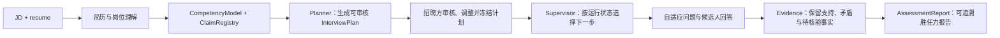
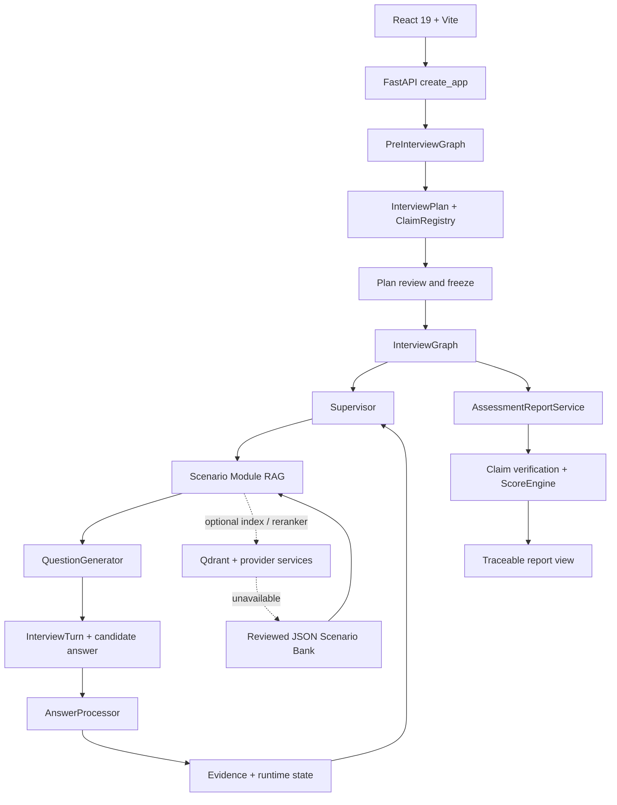

# 衡鉴 Evidence Hiring

面向企业招聘的 AI Agent 胜任力评估：`JD + resume → reviewable plan → adaptive interview → traceable competency report`

衡鉴把岗位描述与候选人简历转成一份可审核的面试计划，在候选人回答后按证据缺口调整问题，并把每个结论连接回面试记录、Evidence 与评分规则。当前实现面向单一岗位标准：`ai_application_engineering / 2026-H2`。

[](https://www.python.org/) [](https://langchain-ai.github.io/langgraph/) [](https://react.dev/) [](https://fastapi.tiangolo.com/)

## 产品流程



## 已实现能力

- **从材料建立验证地图**：`PreInterviewGraph` 并行处理简历与 JD，形成 `CompetencyModel`、`ClaimRegistry` 和 `InterviewPlan`。`Claim` 是待核验的具体简历声明，不是额外题型。
- **计划可审核**：招聘方可以在候选人开始面试前查看计划，调整受控的优先级、目标和时间预算，然后冻结最终计划。能力绑定、Evidence 要求与岗位标准仍受护栏约束。
- **动态面试**：`InterviewGraph` 使用可恢复的 checkpoint 保存 `InterviewTurn`、运行状态与 Evidence；问题由当前 Evidence、剩余时间、题数预算和未完成要求共同决定。
- **证据而非关键词评分**：`AnswerProcessor` 从回答生成结构化 Evidence，报告阶段再把 Evidence 与 rubric、Claim 验证和 `ScoreEngine` 连接起来。缺少证据的维度保留 `UNVERIFIED`，不强行补分。
- **人工可复核结果**：报告同时展示能力维度、岗位匹配限制、优势、风险、未知项、面试路径与 Evidence 摘要；报告用于辅助招聘判断，不自动输出录用或淘汰结论。

## 快速开始

前置条件：Git、Python 3.11+、Node.js `^20.19.0` 或 `>=22.12.0`、`uv`、`pnpm@11.19.0`。两种启动方式都需要在本目录执行，并在两个终端分别启动后端和前端。

### 路径 1：`uv` 最快路径

终端 A：

```powershell
uv sync --frozen --dev
if (-not (Test-Path .env)) { Copy-Item .env.example .env }
uv run uvicorn profile_agent.web.app:create_app --factory --host 127.0.0.1 --port 8000
```

终端 B：

```powershell
pnpm --dir web install
pnpm --dir web dev
```

成功 URL：

- 真实评估入口：<http://127.0.0.1:5173/assessments/new>
- 内置报告演示：<http://127.0.0.1:5173/demo/assessment>
- 后端演示 API：<http://127.0.0.1:8000/api/demo/assessment>

### 路径 2：`venv + pip` 本地开发

终端 A：

```powershell
py -m venv .venv
.\.venv\Scripts\python.exe -m pip install -e .
if (-not (Test-Path .env)) { Copy-Item .env.example .env }
.\.venv\Scripts\python.exe -m uvicorn profile_agent.web.app:create_app --factory --host 127.0.0.1 --port 8000
```

终端 B：

```powershell
pnpm --dir web install
pnpm --dir web dev
```

成功 URL 与上一路径相同：真实评估打开 <http://127.0.0.1:5173/assessments/new>，查看冻结演示打开 <http://127.0.0.1:5173/demo/assessment>。浏览器端通过 Vite 将 `/api` 转发到 `http://127.0.0.1:8000`。

> 内置演示使用冻结的报告数据，不需要真实 provider 调用。真实评估需要在本机配置 LLM provider；真实 LLM、embedding 和 reranker 调用可能产生 provider 费用。

## 企业使用与演示

### 真实评估：`/assessments/new`

这是系统的真实评估入口。招聘方提交 JD，并以文本或 PDF、DOCX、TXT 文件提供简历，系统随后按以下顺序推进：

1. `PreInterviewGraph` 解析材料，建立岗位能力、待核验 Claim 和初始 `InterviewPlan`。
2. 招聘方在 `/assessments/:assessmentId/plan` 审核计划；需要时调整受控字段，再冻结计划。
3. 后端通过 `/interviews/:candidateToken` 驱动候选人面试并在开始时初始化时间与运行状态；当前 React 候选人面试页仍是入口骨架，完整问答交互界面尚待补齐。
4. 面试结束后，`/assessments/:assessmentId/report` 读取服务端保存的报告、面试路径和证据链。

计划审核把岗位标准与候选人实际面试分开：候选人看不到内部 rubric、隐藏约束或排名诊断，招聘方可以在面试开始前确认考察范围。

### 内置报告演示：`/demo/assessment`

这是只读的内置报告演示，用于快速查看一名学生候选人的冻结评估结果，不创建真实评估、不进入候选人互动循环，也不调用模型。它与 `/assessments/new` 的真实材料入口分开，不能替代真实评估流程。

## 自适应面试机制

运行链路是：`Planner → Supervisor → Scenario RAG → QuestionGenerator → AnswerProcessor → Evidence → report`。

| 层 | 它要解决的问题 | 当前实现的边界 |
| --- | --- | --- |
| `Planner` | 根据 `CompetencyModel` 与 `ClaimRegistry` 决定要验证哪些 Target、Evidence Requirement、优先级和推荐题型。 | 生成可审核的 `InterviewPlan`；计划冻结后作为面试的受控输入。 |
| `Supervisor` | 在当前时间、题数、Requirement 状态和已有 Evidence 下选择下一步。 | 使用确定性排序与停止规则，决定 `AskAction` 或 `FinishAction`，而不是让模型自行决定何时结束。 |
| `Scenario RAG` | 为场景题、系统设计题等补充一个有业务约束的真实情景。 | 按岗位维度、Requirement 类型、题型、难度和有效期过滤 `ScenarioModule`，并保留检索来源。 |
| `QuestionGenerator` | 把 `AskAction` 与候选人可见的上下文变成一个可直接回答的问题。 | 项目深挖、场景、系统设计、coding 和 follow-up 使用不同的提问模式；不把 rubric 或排名分数暴露给候选人。 |
| `AnswerProcessor` | 从一轮回答中识别支持、矛盾和缺失事实。 | 通过一次结构化 LLM 调用生成 `EvidenceDraft` 与 Requirement assessment，再由 Python 确定性更新运行状态。 |
| `Evidence` | 让报告知道“结论来自哪一轮、哪段回答、关联哪个要求”。 | `Evidence` 与 `InterviewTurn` 保存 `turn_id`、Requirement 关联、极性、强度、观察和来源摘录。 |
| `report` | 将面试事实转成可审阅的岗位能力结果。 | `AssessmentReportService` 从冻结计划和完整历史构建一次 `ScoreSnapshot`，再投影报告视图。 |

当候选人已经在某个 Requirement 上给出足够证据，`Supervisor` 会转向未覆盖或有矛盾的要求；当回答留下缺口时，下一轮可以使用 `follow_up`，而不是重复一套固定题目。达到时间缓冲、题数上限、停止请求或必要要求已满足时，面试结束并进入报告阶段。

## Scenario Module RAG

Scenario Bank 是按角色标准版本管理的 JSON 事实源，当前包含：

- **10 个 scenarios**：覆盖电商客服、旅行规划、企业知识、招聘面试、代码审查、数据分析、IT 运维、销售跟进等业务世界。
- **35 个 retrieval modules**：每个模块属于一个场景，描述适用的能力维度、题型、难度、开场目标和可观察的 Evidence 信号。
- **38 个 hidden constraints**：保存在内部约束集合中，用于限定问题的业务边界与证据缺口；例如高风险写入需要人工确认、制度版本必须可追溯、失败恢复需要幂等或授权。

检索过程先由 `Supervisor` 给出 Requirement 和题型，再构造 `ScenarioRetrievalRequest`。`ScenarioRetriever` 对候选模块做硬过滤，优先使用可用的向量检索与可选 reranker，最后重新读取 JSON 中的 canonical 场景与模块，避免索引中的旧数据越过角色版本、状态或有效期边界。候选人只接收允许公开的业务目标与情景事实。

Qdrant 索引不是唯一事实源：它可以从 JSON Bank 重建。embedding、reranker 或 Qdrant 等可选检索服务不可用时，系统会回退到经过审核的 JSON 场景模块，而不是让模型自由编造业务世界。启用真实 LLM、embedding 或 reranker 调用可能产生 provider 费用；先用 dry-run 或冻结校准检查配置，再执行带 `--apply` 的索引或评估命令。

检索分数和 `top1_margin` 是单次查询内部的排名诊断，不是跨查询可比较的置信度，也不会直接展示给候选人。

## 证据驱动评分

报告阶段保持面试历史不变，按以下边界生成结果：

1. `ScoringBlueprint` 将每个 `Evidence Requirement` 绑定到一个 `Role Dimension`，保证 Requirement 不遗漏、不重复。
2. rubric matcher 把 Evidence 与最小标准、优秀信号、关键错误和可接受替代项匹配；同时由 `ClaimRegistry` 汇总具体简历声明的验证状态。
3. `RequirementEvidenceAssessmentBuilder` 形成每个 Requirement 的等级、置信度、理由和引用 Evidence。
4. `ScoreEngine` 是唯一生成 Requirement、能力维度和岗位匹配数值的组件。它按 Evidence 覆盖率和门槛维度决定是否发布岗位匹配分。
5. 没有有效 Evidence 的维度保留 `UNVERIFIED` 与 `score=None`；覆盖率不足或门槛维度未验证时，报告给出限制原因，而不是推断一个分数。

报告文案是最后的投影层。若 bounded 的 narrative writer 失败，系统使用按维度生成的确定性 fallback 文案，但保留已经计算出的 `ScoreSnapshot`。这使面试事实、数值评分和对外文案的失败边界可分别检查。

## 技术架构



`PreInterviewGraph` 负责静态计划，`InterviewGraph` 负责候选人真正开始后的中断、恢复、问答与结束。默认 Web container 使用 SQLite 保存评估记录和 checkpoint；当前文档不把它描述为已经部署的生产服务。

## 校准与测试

### Scenario Module RAG 冻结校准

以下是冻结的 24-case calibration snapshot，属于历史可复核证据，不是永久质量徽章：

| 指标 | 结果 | 解释 |
| --- | --- | --- |
| cases | `24` | 六个能力维度各四个 reviewed cases。 |
| Top-1 acceptable | `24/24` | Top-1 选中的模块满足 acceptable 集合。 |
| Top-3 recall | `24/24` | acceptable 模块在 Top-3 中被召回。 |
| forbidden Top-1 | `0` | Top-1 没有命中 forbidden module。 |
| fallback | `0` | 冻结校准运行没有 fallback outcome。 |
| Top-3 forbidden diagnostics | `7` | 仍有七个诊断命中；它们用于定位相邻业务世界的混淆，不属于 acceptance failure。 |

Top-1 是运行时实际采用的 Module；Top-3 forbidden 命中只作为诊断保留。因此这组结果同时报告通过的 acceptance gate 与仍需跟进的七个诊断，不把诊断项隐藏成通过率。

可用以下命令做不调用 provider 的校验或预览；带 `--apply` 的索引重建与检索评估会调用外部服务并可能产生费用：

```powershell
uv run python run_scenario_bank.py validate
uv run python run_scenario_bank.py rebuild-index
uv run python run_scenario_bank.py evaluate
```

### 测试快照与复现

设计冻结时记录的历史快照为 **868 tests passed、827 subtests、6 deprecation warnings**。这是一条可复现的历史证据，不作为徽章或永久承诺。当前工作区验收使用：

```powershell
uv run pytest -q
pnpm --dir web test
pnpm --dir web build
```

后端测试覆盖图、服务、Schema、Scenario Bank、报告与校准边界；前端测试使用 Vitest，生产构建使用 TypeScript 编译与 Vite 打包。

## 配置

<details>
<summary>查看本地配置变量与费用边界</summary>

配置模板见 [`.env.example`](../.env.example)。真实值只应保存在本机 `.env` 或进程环境中，不要写入仓库、题库、日志或命令输出。

| 变量 | 用途 |
| --- | --- |
| `QWEN_API_KEY`、`QWEN_BASE_URL`、`QWEN_MODEL`、`QWEN_TIMEOUT` | 真实评估所需的 OpenAI-compatible LLM provider 配置。 |
| `SILICONFLOW_API_KEY`、`SILICONFLOW_EMBEDDING_*` | Scenario Module RAG 的 embedding；有 key 时可启用可选 reranker。 |
| `SCENARIO_RAG_INDEX_PATH` | 本地 Qdrant Scenario Module 索引路径。 |
| `SCENARIO_RAG_QDRANT_URL`、`SCENARIO_RAG_QDRANT_API_KEY` | 远程 Qdrant 连接；只在本机配置需要的认证信息。 |
| `LLM_TEMPERATURE`、`LLM_MAX_TOKENS`、`LLM_TOP_P` | LLM 通用参数。 |
| `LLM_TRACE_ENABLED`、`LLM_TRACE_PATH` | 可选的本地 JSONL trace；开启前确认输出目录和数据处理范围。 |
| `WEB_DATABASE_PATH`、`WEB_CHECKPOINT_PATH` | Web 评估记录与 LangGraph checkpoint 的本地 SQLite 路径。 |

基础启动与内置演示不要求配置 provider key。真实评估的计划生成、问题生成、回答处理和报告文案可能使用真实 LLM；启用 embedding 或 reranker 也可能产生 provider 费用。Scenario RAG 的可选服务失败时，会使用 reviewed JSON scenario fallback。

完整变量名与默认值请以 [`.env.example`](../.env.example)、[`pyproject.toml`](../pyproject.toml) 和运行时代码为准；README 不复制任何 key 值或类似真实 Secret 的示例。

</details>

## 技术栈

| 层 | 组件 |
| --- | --- |
| Backend | Python 3.11+、FastAPI、Uvicorn、Pydantic、`python-docx`、PyMuPDF、LangGraph。 |
| Agent runtime | LangGraph `0.2+`、`PreInterviewGraph`、`InterviewGraph`、SQLite checkpoint。 |
| Retrieval | Scenario Bank JSON、Qdrant client、embedding 与可选 reranker。 |
| Frontend | React `19`、React Router、TypeScript、Vite、Vitest。 |
| Tooling | `uv`、`pnpm@11.19.0`、GitHub Actions。 |

## 项目结构

<details>
<summary>展开项目结构</summary>

```text
AI_Interview/
├─ profile_agent/
│  ├─ graphs/                 # PreInterviewGraph 与 InterviewGraph
│  ├─ nodes/                  # 输入、理解、能力建模、Planner、评分蓝图节点
│  ├─ services/               # Supervisor、RAG、回答处理、报告与评分服务
│  ├─ schemas/                # Plan、Runtime、Evidence、Scenario、Report 契约
│  ├─ calibration/            # 冻结校准案例、运行器与断言
│  ├─ knowledge/
│  │  └─ scenario_banks/
│  │     └─ ai_application_engineering_2026_h2/
│  │        ├─ ScenarioBankManifest.json
│  │        ├─ scenarios.json
│  │        ├─ modules.json
│  │        └─ constraints.json
│  └─ web/                    # FastAPI factory 与 Web container
├─ web/
│  ├─ src/app/router.tsx      # React routes
│  └─ src/features/           # Assessment、Plan、Interview、Report 页面
├─ tests/                     # 后端离线测试与 Scenario calibration fixture
├─ docs/superpowers/
│  ├─ specs/                  # 绑定设计
│  └─ plans/                  # 实施计划
├─ run_scenario_bank.py       # Scenario Bank 校验、索引预览与校准
├─ run_interview_demo.py      # 终端交互式面试入口
├─ pyproject.toml
├─ uv.lock
└─ .env.example
```

校准、构建和测试生成的本地输出不属于 README 的运行时契约；尤其不要将 `artifacts/question_corpus` 的本地变化作为本次文档提交的一部分。

</details>

## FAQ

### 真实评估从哪里开始？

打开 `/assessments/new`。它会接收 JD 与简历，创建评估并进入计划审核。`/demo/assessment` 只读取内置冻结报告。

### 没有 provider key 能看什么？

可以启动 Web、运行离线测试并打开内置演示。真实评估的 LLM 阶段需要本机 provider 配置；可选的 embedding、reranker 或 Qdrant 不可用时，Scenario RAG 使用 reviewed JSON fallback。

### 这是通用的多岗位招聘平台吗？

不是。当前角色范围严格是 `ai_application_engineering / 2026-H2`；Scenario Bank 虽包含多个业务场景，但它们是该岗位标准下用于出题的场景模块，不代表已经实现了多个 job family。

### 报告里的分数能直接决定录用吗？

不能。分数只从已收集的 Evidence 和冻结 rubric 计算；未验证维度会保留 `UNVERIFIED`。报告用于辅助决策，仍需要招聘方结合人工复试、岗位语境和其他合法信息判断。

### 如何复现 Scenario Bank 结果？

先运行 `uv run python run_scenario_bank.py validate`，再运行 `rebuild-index` 或 `evaluate` 的预览；真实 provider 运行使用 `--apply`，可能产生费用，结果与诊断写入本地 artifacts。

## 当前范围

- **岗位标准**：`ai_application_engineering / 2026-H2`，对应当前的 `Role Pack`、六个能力维度和一套 Scenario Bank。
- **已实现流程**：JD/简历输入、可审核计划、计划冻结、后端动态面试运行时、Scenario Module RAG、Evidence 处理、确定性评分与可追溯报告。
- **明确边界**：候选人 Web 问答页目前仍是入口骨架；本项目也不声称已实现多个岗位族、生产部署、发布镜像或持久化云端 checkpointer。

绑定设计与实施依据见 [`2026-08-31-competition-first-readme-design.md`](superpowers/specs/2026-08-31-competition-first-readme-design.md) 和 [`2026-08-31-competition-first-readme.md`](superpowers/plans/2026-08-31-competition-first-readme.md)。

## 许可证与容器镜像

当前仓库尚未提供 `LICENSE`，也没有发布到 Docker Hub 的镜像，因此暂不展示 License 或 Docker Pulls 徽章。后续只有在许可证文件和公开镜像真实存在后才会补充相应徽章与使用说明。
