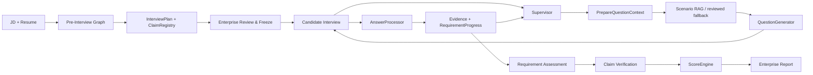

# README Portfolio Design Spec

> Status: implementation baseline
> Audience: AI Agent / LLM Application / Backend technical interviewers and competition reviewers
> Scope: README information architecture, evidence assets, copy rules, capture rules, verification
> Non-goal: change business logic, add paid-model demo features, fabricate online deployment

## 1. Objective

Turn the repository homepage from a technical manual into a **technical portfolio landing page backed by real product evidence**.

A reviewer should be able to:

1. understand the product, user and outcome in **30 seconds**;
2. understand one complete enterprise → candidate → report workflow in **3 minutes**;
3. see why the project is not a fixed question bank or an unconstrained LLM chat wrapper;
4. inspect architecture, retrieval calibration, test evidence and local run instructions only when needed;
5. verify every important claim from screenshots, repository code, frozen demo data, tests or reproducible commands.

The README must optimize for **scanability and proof density**, not completeness.

---

## 2. Repository facts confirmed before redesign

### 2.1 Product routes already exist

The current frontend has these real routes:

| Product stage | Route | Role |
| --- | --- | --- |
| Create assessment | `/assessments/new` | Enterprise / interviewer |
| Analyze materials | `/assessments/{assessmentId}/analyzing` | Enterprise / interviewer |
| Review & freeze plan | `/assessments/{assessmentId}/plan` | Enterprise / interviewer |
| Candidate interview | `/interviews/{candidateToken}` | Candidate |
| Enterprise report | `/assessments/{assessmentId}/report` | Enterprise / interviewer |
| Frozen zero-cost report demo | `/demo/assessment` | Reviewer / interviewer |

Therefore README does **not** need decorative mockups to explain the workflow. It should use these real pages.

### 2.2 Real page capabilities suitable for screenshots

**Create Assessment** already exposes:
- target role;
- JD input;
- resume text/file input;
- assessment duration;
- model settings / BYOK;
- submit flow.

**Plan Review** already exposes:
- candidate profile;
- Claim Register;
- six role dimensions;
- Interview Targets;
- Evidence Requirements;
- editable business focus and time budget;
- deterministic edit guardrails;
- freeze / candidate access flow;
- enterprise candidate progress after freeze.

**Candidate Interview** already exposes:
- role title;
- current question number;
- one-question-at-a-time answer UI;
- elapsed time;
- start / reporting / complete states.

**Enterprise Report** already exposes:
- candidate overview;
- enterprise decision brief;
- overall assessment;
- strengths / risks / unknowns;
- coverage / confidence / interview rounds;
- six-dimension radar;
- job-match boundary;
- re-interview plan;
- full transcript;
- evidence drawer linked to turns.

The report page is the strongest visual proof of the product and should be the README hero.

### 2.3 A zero-provider demo already exists

`/demo/assessment` is backed by frozen, model-free report data. The public showcase is an anonymous student candidate case with five interview turns. It is validated before being returned and does not call a provider.

This makes it the preferred source for:
- `hero-report.png`;
- report/evidence screenshots;
- reviewer demo instructions.

It is safer and more reproducible than using a private real candidate assessment for README visuals.

### 2.4 Real closed-loop dynamic-follow-up evidence exists

The integration test `test_follow_up_selects_constraint_from_missing_evidence_gaps` exercises the real graph boundary:

```text
Requirement: Memory write/delete boundary
Dimension: role_dim_03
Candidate answer / assessment result:
  "Memory 删除已说明，但未证明版本与引用。"

AnswerProcessor
  → missing_evidence_tags = ["版本", "引用"]

InterviewRuntimeState
  → latest_gap_tags = ["版本", "引用"]

PrepareQuestionContext / Constraint Selector
  → selected_constraint_id = knowledge_policy_version_stale
  → NOT knowledge_memory_delete
```

This is a strong engineering proof because it demonstrates:

```text
candidate answer
→ structured evidence gap
→ persisted runtime progress
→ next-turn constraint selection
```

**Important boundary:** the integration test uses a Generator Spy (`问题 1`, `问题 2`). README may show the decision trace above, but must not invent a natural-language follow-up question. A candidate-facing question/answer example must come from an actual runtime trace or screenshot.

### 2.5 Current visual asset gap

At the time of this spec, `docs/assets/` contains only:

```text
candidate-interview-complete.png
```

That image is valid supporting evidence but is a weak hero because it only proves the terminal candidate state. It should be retained as a secondary workflow asset or replaced by a more informative active-interview screenshot.

---

## 3. Primary audience and narrative priority

### Primary audience

1. technical interviewers hiring AI Agent / LLM Application engineers;
2. backend / AI application engineering interviewers;
3. competition technical reviewers.

### Secondary audience

- engineers who want to run the project locally;
- reviewers who want to audit architecture or calibration;
- future contributors.

### Narrative rule

README order must be:

```text
RESULT
↓
PRODUCT WORKFLOW
↓
ENGINEERING PROBLEMS SOLVED
↓
ONE REAL CLOSED LOOP
↓
ARCHITECTURE
↓
MEASURED EVIDENCE
↓
RUN IT
↓
DETAILS / BOUNDARIES
```

Do not start with environment setup, module counts or framework names.

---

## 4. README information architecture

## 4.1 Hero — above the first long scroll

Required content:

```text
衡鉴 · Evidence Hiring

Evidence-driven AI Interview Agent

从 JD 与候选人简历生成可审核的动态面试，
让每项能力结论都能追溯到候选人的原始回答。

[产品链路] · [架构] · [本地运行]

CI · Python · FastAPI · LangGraph · React

[hero-report.png]
```

Rules:
- one H1 only;
- one short Chinese value statement;
- optional one English descriptor, not a second marketing slogan;
- maximum 5 factual badges;
- no emoji wall;
- no LICENSE / Docker badges until those artifacts exist;
- hero image must show the **enterprise report**, not the completion thank-you screen.

### Hero image crop

Preferred viewport capture: `1440 × 900` or `1600 × 1000`.

The visible hero crop should include as many of these as possible:
- `岗位胜任力报告`;
- anonymous candidate / target role;
- enterprise decision brief;
- coverage / confidence metrics;
- top portion of radar chart.

Do not capture browser tabs, localhost address bar, API keys or OS taskbar.

---

## 4.2 “一次评估如何完成” — four-stage product workflow

Use four real images from the same visual language:

### 01 — Create

Asset: `docs/assets/readme/workflow-create.png`

Source route:
```text
/assessments/new
```

Frame must show:
- page title;
- JD section;
- candidate material section;
- submit panel;
- model setting summary only if it contains no secret.

Caption:
> 企业输入真实 JD 与候选人材料，建立本次评估上下文。

### 02 — Review Plan

Asset: `docs/assets/readme/workflow-plan.png`

Source route:
```text
/assessments/{assessmentId}/plan
```

Preferred frame:
- Candidate Signal;
- Claim Register;
- Role Dimensions;
- first 1–2 Interview Targets;
- at least one Evidence Requirement;
- deterministic control panel if layout allows.

Caption:
> Planner 先形成可审核验证计划；企业可以调整业务重点，但不能删除岗位基线与证据要求。

### 03 — Dynamic Interview

Asset: `docs/assets/readme/workflow-interview.png`

Source route:
```text
/interviews/{candidateToken}
```

Use an **active question**, not the completion page.

Preferred frame:
- role title;
- question number;
- a meaningful Agent engineering question;
- answer input;
- elapsed-time indicator.

Caption:
> 候选人一次只看到当前问题；每轮回答进入 Evidence / Runtime，再决定后续追问。

### 04 — Evidence Report

Asset: `docs/assets/readme/workflow-report-evidence.png`

Source route:
```text
/demo/assessment
```

Preferred state:
- radar or decision summary visible;
- Evidence Drawer open;
- one evidence excerpt linked to a transcript turn.

Caption:
> 最终结论不是一段 LLM 总结：能力维度、判断理由和原始回答片段可以相互追溯。

### Layout rule

Do not stack four full-width 1600px screenshots one after another.

README should use compact two-column HTML/table layout when GitHub rendering remains stable, or show one workflow strip plus expandable full-size screenshots.

Suggested pattern:

```html
<table>
  <tr>
    <td width="50%"><br><b>01 创建评估</b>...</td>
    <td width="50%"><br><b>02 审核计划</b>...</td>
  </tr>
  <tr>
    <td width="50%"><br><b>03 动态面试</b>...</td>
    <td width="50%"><br><b>04 证据报告</b>...</td>
  </tr>
</table>
```

---

## 4.3 “我解决的不是出题，而是验证链路” — engineering highlights

Use **Problem → Design → Proof**, never framework-name piles.

Recommended table:

| Engineering problem | Design | Verifiable proof |
| --- | --- | --- |
| Fixed question sets cannot react to incomplete answers | `Evidence Gap → RequirementProgress → Supervisor` | graph integration test preserves `latest_gap_tags` and changes next-turn constraint |
| RAG can accidentally decide what to assess | Supervisor locks Requirement first; Scenario RAG only supplies the business world | Scenario retrieval request is filtered by dimension / requirement type / mode / difficulty; no compatible reviewed module safely degrades to no-scenario questioning |
| LLM-generated numeric scores are hard to audit | Evidence → RequirementAssessment → ClaimVerification → deterministic `ScoreEngine` | server report keeps unverified dimensions as unverified; frontend does not recalculate scores |
| Per-user model config can leak across concurrent requests | assessment-scoped runtime context + in-memory BYOK session | model session API performs structured-output probe; secret is not persisted in assessment JSON |
| Retrieval quality cannot be justified by “looks relevant” | reviewed calibration cases + acceptable/forbidden sets | publish only current reproducible Top-1 / Top-3 / forbidden diagnostics |

Rules:
- maximum 5 main highlights;
- each row must have an actual code/test/data proof;
- if a proof is only a unit test, say so;
- do not call a component “production-grade” unless deployment properties actually support that claim.

---

## 4.4 One real dynamic-follow-up case

This section is mandatory because it differentiates the project from a pre-generated interview script.

### Phase A — can be written immediately from repository evidence

Title:
> 一次追问是怎样被上一轮回答改变的？

Use the verified internal trace:

```text
当前验证目标
Memory 写入 / 删除边界 · role_dim_03

候选人回答后的结构化判断
"Memory 删除已说明，但未证明版本与引用。"

AnswerProcessor
missing_evidence_tags = ["版本", "引用"]

Runtime
latest_gap_tags = ["版本", "引用"]

Next-turn context selection
knowledge_policy_version_stale

Not selected
knowledge_memory_delete
```

Then explain in one paragraph:

> The system did not ask a generic second Memory question. The previous answer changed the structured evidence gap stored in Runtime, and that gap changed the reviewed constraint eligible for the next turn.

### Phase B — add only after real runtime capture

Add the exact candidate-facing next question and exact previous answer excerpt from a real local assessment trace.

Rules:
- quote only data from the project run;
- anonymize candidate identity;
- never synthesize a prettier question;
- if no real trace has been captured, keep Phase A only.

---

## 4.5 Architecture — one diagram, not three competing diagrams

README should contain one canonical Mermaid diagram:



Under the diagram, preserve one responsibility sentence:

> Supervisor 决定考什么；RAG 决定放在哪个业务场景里考；Constraint Selector 决定本轮允许暴露哪个审核过的约束；QuestionGenerator 只负责把锁定内容问自然。

Do not duplicate the same flow as another large sequence diagram in README. Move deeper graph diagrams to docs.

---

## 4.6 Measured evidence — compact proof board

This section should answer: “What did you actually measure?”

### Retrieval calibration

Only include values that are generated by the current frozen calibration set and can be reproduced from repository commands.

Recommended format:

| Metric | Current verified result |
| --- | ---: |
| reviewed retrieval cases | 24 |
| Top-1 acceptable | 24 / 24 |
| Top-3 recall | 24 / 24 |
| forbidden Top-1 | 0 |
| fallback | 0 |
| Top-3 forbidden diagnostics | 7 |

Add one sentence explaining that `Top-3 forbidden diagnostics` is diagnostic, not an acceptance result.

### CI verification

Update from the latest green CI run only.

At the time this spec was written, the verified main-branch run reported:

```text
Backend: 883 passed, 6 warnings, 831 subtests passed
Frontend: 12 test files / 43 tests passed
Production build: PASS
```

Do not preserve these numbers forever. When README is implemented, copy the values from the latest final verification run.

---

## 4.7 Quick run — exactly two paths

### Path A — zero-provider reviewer demo

This must appear first.

```powershell
uv sync --frozen --dev
pnpm --dir web install --frozen-lockfile

# Terminal A
uv run uvicorn profile_agent.web.app:create_app --factory --host 127.0.0.1 --port 8000

# Terminal B
pnpm --dir web dev
```

Open:

```text
http://127.0.0.1:5173/demo/assessment
```

Copy rule:
> Uses frozen anonymous showcase data and does not call a paid LLM provider.

### Path B — real assessment

Explain only:

```text
Configure server .env or use page-level BYOK
→ /assessments/new
→ JD + resume
→ analyze
→ review & freeze
→ candidate link
→ enterprise report
```

Do not put the full provider configuration matrix in the main README body.

---

## 4.8 Technical stack, configuration and repository structure

Keep the technology stack short:

```text
Python · FastAPI · LangGraph · Pydantic
React · TypeScript · Vite
SQLite checkpoint / assessment persistence
Qdrant · embedding · optional reranker for Scenario RAG
```

Long details move into `<details>`:
- environment variables;
- BYOK boundaries;
- Scenario Bank maintenance commands;
- repository tree;
- deployment limitations.

README should link to `docs/PROJECT_DETAILS.md` and other deep docs instead of repeating them.

---

## 4.9 Delivery boundary

Place near the end, not above product proof.

Use a compact two-column table:

| Implemented | Not currently claimed |
| --- | --- |
| JD/resume ingestion | multi-role platform |
| reviewable/frozen InterviewPlan | production multi-instance secret store |
| candidate adaptive interview | voice/avatar interview |
| Scenario Module RAG + reviewed fallback | published Docker image |
| Evidence / Claim / deterministic scoring | autonomous hiring decision system |
| enterprise radar/report/evidence trace | LICENSE until one is actually selected |

Avoid defensive wording throughout the README. State boundaries once, clearly, near the end.

---

## 4.10 后期计划

Roadmap 放在交付边界之后。开头先明确当前版本已经完成：

```text
JD / Resume → InterviewPlan → Plan Review → Dynamic Interview → Evidence → Deterministic Scoring → Enterprise Report
```

后续计划使用未完成复选框，并按以下三个部分组织。完成并经过验证的项目从 Roadmap 删除，移动到已实现能力或 Release，不在 README 中长期堆放已勾选事项。

### Agent 能力

- [ ] **长期记忆（Long-term Memory）**

  在当前单次面试 Runtime 之外增加跨场次记忆，并明确区分：

  - **语义记忆（Semantic Memory）**：候选人的稳定事实、项目背景、已确认技能与岗位相关信息；
  - **情景记忆（Episodic Memory）**：历史面试中的问题、回答、Evidence、矛盾点和未完成验证项；
  - **程序性记忆（Procedural Memory）**：经过测试证明有效的提问、追问和验证策略。

  重点解决记忆的写入时机、检索范围、来源追溯、冲突更新、删除和过期问题，并避免不同候选人或不同企业之间发生记忆串线。

  程序性记忆可以影响提问和验证策略，但不能自动修改 Role Pack、Rubric、评分权重等确定性规则。

- [ ] **场景库持续更新（Continuous Scenario Intelligence）**

  定期从公开岗位 JD、官方技术文档、工程案例和面试方向中发现新的候选场景，而不是长期依赖一套静态 Scenario Bank。

  更新链路为：

  `公网检索 → 来源归一化 → 去重 → 时效性检查 → Candidate Scenario → 人工 Review → Retrieval Calibration → Versioned Scenario Bank`

  未经审核的网页内容不能直接进入正式 RAG。新版本发布前继续验证 Top-1、Top-3、Forbidden Result、Fallback 等固定检索指标，并保留数据来源和版本信息。

- [ ] **Agent 可观测性与回放（Observability & Replay）**

  为每一轮面试记录完整的 Agent 决策链，包括 Supervisor 的选择原因、Evidence Gap、Scenario RAG 结果、Constraint 选择、最终问题、AnswerProcessor Evidence、RequirementProgress 变化、路由结果，以及每轮 LLM 的耗时、Token 和费用。

  最终支持按 Turn 回放整条决策路径，用于调试错误追问、错误检索和异常评分来源。

- [ ] **外部证据验证工具（Evidence Tools）**

  只在候选人声明能够通过外部系统验证时引入有限 Tool Calling，例如 Git Repository / GitHub 项目检查、项目目录与依赖读取、受限 Sandbox 代码执行，以及测试、日志和提交记录核验。

  工具只提供外部事实，结果仍进入统一 Evidence Pipeline。Tool 本身不能直接决定分数，也不为了展示 Function Calling 而加入无关工具。

### 产品能力

- [ ] **企业工作台（Enterprise Workspace）**

  增加候选人与 Assessment 列表、等待面试 / 面试中 / 已完成状态、邀请链接管理、报告归档、历史评估检索，以及基础搜索和筛选。

- [ ] **Role Pack 扩展**

  在当前 `ai_application_engineering / 2026-H2` 之外逐步支持更多技术岗位。每个岗位独立维护 Competency Dimensions、Evidence Requirements、Rubric、Scenario Bank、Calibration Cases 和 Profile Version，同时复用同一套 Interview Engine。

- [ ] **语音与虚拟数字人面试**

  在现有文字面试基础上增加：

  `STT → Interview Runtime → Question → TTS → Avatar`

  支持语音转文字、文字转语音、实时字幕和虚拟面试官交互，并继续复用现有 Supervisor、Evidence、Runtime 和 ScoreEngine。

  多模态能力只作为交互层，不根据候选人的外貌、声音特征或表情进行能力评分。

### 部署与安全

- [ ] **企业认证与租户隔离**：增加企业账号、Organization / Tenant 和 Assessment Ownership，确保不同企业只能访问自己的候选人和报告。
- [ ] **候选人邀请链接治理**：为 Candidate Token 增加过期、撤销、重新生成和访问控制，不长期依赖永久 Bearer Link。
- [ ] **模型密钥持久化**：将 BYOK Secret 从单个服务进程内存迁移到专门的 Secret Store，支持服务重启和多实例部署。
- [ ] **生产数据基础设施**：从单机开发环境逐步迁移到正式数据库、数据库迁移机制和多实例共享状态。
- [ ] **公开演示与部署**：保留无需 API Key 的冻结 Demo，并进一步部署可公开访问的产品版本，方便评审和技术面试官直接体验完整产品链路。

---

## 5. Visual asset specification

All README assets live under:

```text
docs/assets/readme/
```

Required files:

```text
hero-report.png
workflow-create.png
workflow-plan.png
workflow-interview.png
workflow-report-evidence.png
```

Optional only after the required set is good:

```text
product-tour.gif
```

### 5.1 Capture dimensions

Preferred source viewport:
- desktop width: `1440` or `1600` CSS px;
- height: `900`–`1000` CSS px;
- device pixel ratio: 1 or 1.25 for manageable image size.

Avoid inconsistent captures such as one 1920px image, one phone screenshot and one browser-chrome screenshot.

### 5.2 File size targets

PNG:
- target: `< 700 KB` each;
- hard preference: `< 1 MB` each;
- crop whitespace before aggressive compression.

GIF, if created:
- width: `<= 1280px`;
- duration: `10–18s`;
- frame rate: `8–12fps`;
- target size: `< 5 MB`;
- do not use a 20–50 MB GIF in README.

### 5.3 Sanitization

Forbidden in screenshots:
- API keys;
- provider secrets;
- personal absolute paths;
- real candidate names, emails, phones or IDs;
- private JD data without permission;
- candidate tokens;
- localhost URL bar if it exposes a raw token.

Preferred screenshot data:
- frozen anonymous demo;
- public sample JD;
- synthetic/anonymized candidate material;
- current public role profile.

### 5.4 Screenshot annotation

Default: no arrows, circles or colorful overlay labels.

The product UI should speak for itself. Add annotations only if a screenshot cannot be understood with a one-sentence caption.

---

## 6. Copy design rules

### 6.1 Tone

- professional;
- technical;
- concise;
- evidence-first;
- no inflated marketing language.

Avoid unsupported phrases:
- “行业领先”;
- “生产级”;
- “高准确率”;
- “全自动招聘”;
- “智能精准匹配”.

Prefer:
- “可审核”;
- “可追溯”;
- “确定性评分边界”;
- “reviewed calibration”;
- “current single-instance boundary”.

### 6.2 Headings

Good:
- `一次评估如何完成`
- `为什么上一轮回答会改变下一题`
- `我解决的不是出题，而是验证链路`
- `检索质量怎么证明`

Weak:
- `核心功能`
- `技术架构介绍`
- `项目优势`
- `功能特性`

Headings should answer reviewer questions, not label document categories.

### 6.3 Numbers

A number can appear only if it has a verification source:
- canonical knowledge file;
- frozen calibration artifact;
- current CI log;
- deterministic repository test.

Do not use internal object counts as hero marketing numbers unless they help explain an engineering decision.

---

## 7. README length and progressive disclosure

Target main README body: roughly **180–260 meaningful lines**, excluding Mermaid/HTML markup.

The first two screenfuls should contain:
- positioning;
- hero screenshot;
- workflow summary.

The first 3 minutes of scrolling should contain:
- four-stage product path;
- engineering highlights;
- dynamic-follow-up proof.

The rest contains:
- architecture;
- measured evidence;
- quick run;
- tech stack;
- boundaries;
- deep-doc links.

Use `<details>` for:
- full environment config;
- detailed directory tree;
- advanced Scenario Bank commands;
- BYOK threat-model notes;
- long calibration methodology.

---

## 8. Product-tour GIF decision

GIF is **not a release blocker**.

Create it only if:
- the five required PNG assets are finished;
- the workflow can be shown in <=18 seconds;
- the file remains <=5 MB;
- it adds information beyond the screenshots.

If not, skip it. Four/five crisp real screenshots are better than a blurry large GIF.

---

## 9. Implementation sequence

### Phase 0 — asset inventory (done in this spec)

Confirmed:
- real create / plan / interview / report routes exist;
- frozen zero-cost report demo exists;
- only one README screenshot currently exists;
- a real graph-level evidence-gap closed loop exists;
- latest CI values can be sourced from GitHub Actions.

### Phase 1 — capture assets

1. Capture `hero-report.png` from `/demo/assessment`.
2. Capture `workflow-report-evidence.png` from the same demo with Evidence Drawer open.
3. Capture `workflow-create.png` using sample/anonymized material.
4. Capture `workflow-plan.png` from a real generated anonymized assessment.
5. Capture `workflow-interview.png` from an active real candidate turn.
6. Move/rename the current completion screenshot under `docs/assets/readme/` only if it remains useful as secondary evidence.

### Phase 2 — rewrite README

Rewrite from scratch against this IA. Do not incrementally append more sections to the current README.

### Phase 3 — content verification

Verify:
- all relative image links render on GitHub;
- all Mermaid syntax renders;
- all commands work from a clean checkout;
- no secret or token is visible;
- test/calibration numbers match current artifacts;
- zero-provider demo really stays provider-free.

### Phase 4 — final repository review

Run:

```powershell
uv run pytest -q
pnpm --dir web test
pnpm --dir web build
```

Then inspect the GitHub README in the rendered repository view, not only raw Markdown.

---

## 10. Acceptance criteria

README redesign is accepted only if all are true:

- [ ] First screen contains project identity, one-sentence outcome, factual badges and a real enterprise-report hero.
- [ ] A reviewer can identify enterprise user, candidate user and system responsibility without reading architecture code.
- [ ] At least four real product-stage screenshots exist under `docs/assets/readme/`.
- [ ] Hero is a report/result image, not a completion thank-you page.
- [ ] One real evidence-gap → runtime → next-turn selection trace is shown.
- [ ] No candidate-facing follow-up wording is invented from a test spy.
- [ ] Main engineering highlights use Problem → Design → Proof.
- [ ] Retrieval metrics and CI numbers come from current reproducible evidence.
- [ ] Zero-provider demo is the first local reviewer path.
- [ ] Long config / directory / threat-model content is folded or moved to deeper docs.
- [ ] No API key, candidate token, personal path or sensitive candidate information appears in screenshots.
- [ ] README does not claim multi-role, voice/avatar, Docker image, license or production multi-instance secret storage unless those facts change.
- [ ] Backend tests, frontend tests and production build pass after the documentation changes.

---

## 11. Final design principle

The README should not try to prove that the repository is large.

It should prove, in this order, that:

```text
this is a real product
→ the product has a complete enterprise/candidate loop
→ the Agent changes behavior from evidence
→ responsibility boundaries are engineered rather than prompt-only
→ conclusions are traceable
→ retrieval and runtime behavior are tested
→ another engineer can run and inspect it
```

Every section, screenshot and number that does not strengthen one of those claims should be removed or moved to deeper documentation.
